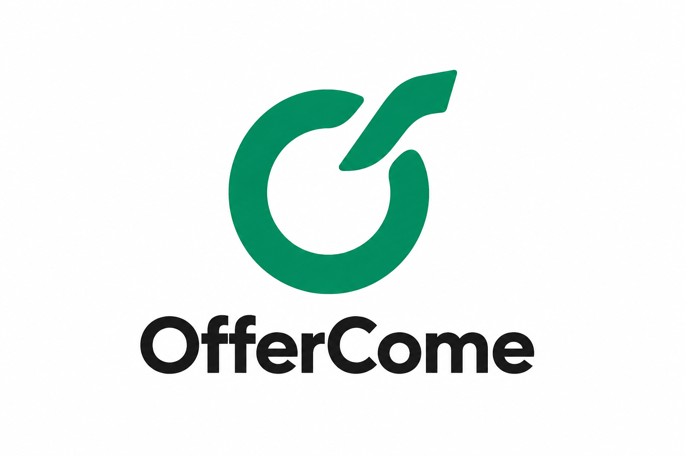
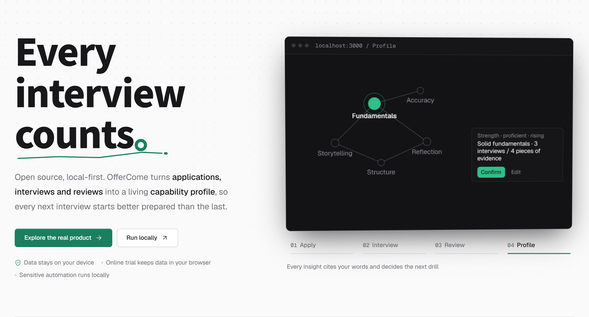

<div align="center">

<h1></h1>

**A local-first workspace that turns every application and interview into better preparation for the next one.**

[简体中文](README_CN.md) · [Product Site](https://offercome.yuecao.dev) · [Try in Browser](https://offercome.yuecao.dev/homepage)


[How It Works](#how-it-works) · [Quick Start](#quick-start) · [Features](#features) · [Preview](#project-preview) · [Under the Hood](#under-the-hood)

</div>

## How It Works

OfferCome connects applications, resumes, interviews, and review in one workspace. Past answers and capability insights help shape your next practice session.

```text
Applications ──▶ Resume & projects ──▶ AI mock interview ──▶ Real interview
     ▲                                        │                     │
     │                                        ▼                     ▼
     └──────────── Capability profile ◀── Review & scoring ◀── Import & transcribe
```

## Quick Start

### Try in your browser

Open [OfferCome](https://offercome.yuecao.dev/homepage), add your resume, and connect your own text model to practise. The web app starts with an empty workspace and saves your work and resume files in your browser.

Model connections, including API keys, are remembered in the browser by default; you can choose session-only storage. The server processes uploaded content and AI requests using your configuration without saving workspace data or keys to its database or files. Clearing site data removes your local copy.

**Boss Zhipin sync, voice answers, interview material import, and web search require local deployment.**

### Docker (recommended for local use)

**Requirements:** Docker Desktop or Docker Engine with Docker Compose.

```bash
git clone https://github.com/yuecao365/OfferCome.git
cd OfferCome
docker compose up -d --build
```

Open [http://localhost:3000](http://localhost:3000) and configure your model providers under **Settings**.

Your database and uploaded files persist in Docker volumes on your machine. Configured AI tasks send the relevant input to your chosen provider. Use `docker compose down` to stop; adding `-v` permanently deletes the data volumes.

### Run from source

**Requirements:** Node.js 22+ and npm; Chrome or Edge for Boss Zhipin login. Windows PowerShell:

```powershell
git clone https://github.com/yuecao365/OfferCome.git
Set-Location OfferCome
Copy-Item .env.example .env.local
npm ci
npm run db:push
npm run dev
```

Open [http://localhost:3000](http://localhost:3000) and configure **Settings**. For browser login and sync, see the [deployment guide](docs/deployment.md#boss-zhipin-sync).

## Features

| Feature | What you can do |
| --- | --- |
| **Applications** | Import existing Boss Zhipin records or add applications manually. Track stages and changes in the dashboard. Sync reads your records; it never applies or messages on your behalf. |
| **Resumes** | Extract internships and projects from PDF, Word, or image resumes. Review and edit the extracted experiences, then use them as interview material. |
| **AI mock interviews** | Practise with questions grounded in skill packs, your resume, past answers, and profile insights. Get follow-up questions, rubric-based scoring, and an action plan. Voice answers are available locally. |
| **Interview history** | Record interviews manually, or import recordings, transcripts, and notes locally. Review extracted questions before saving. Upcoming interviews have a preparation page. |
| **Review** | Group similar questions across interviews, compare your previous answers, and practise again. Browse by project or question bank and correct classifications. |
| **Capability profile** | Track strengths and gaps across eight dimensions, with feedback supported by excerpts from your answers. Inspect or exclude evidence, protect insights, and launch targeted practice. |

> **Sync rule:** During a Boss sync, applications still at “Applied” with at least 30 days since their last recorded activity can be marked “Rejected.” Deleted applications stay excluded. See [sync behavior](docs/deployment.md#boss-zhipin-sync).

## Project Preview

Screenshots use fictional data from a local deployment.

<table>
  <tr>
    <td width="50%" align="center"><strong>AI Mock Interview</strong><br></td>
    <td width="50%" align="center"><strong>Capability Profile</strong><br></td>
  </tr>
</table>

<details>
<summary>More screenshots and product overview</summary>

<table>
  <tr>
    <td width="50%" align="center"><strong>Dashboard</strong><br></td>
    <td width="50%" align="center"><strong>Applications</strong><br></td>
  </tr>
  <tr>
    <td width="50%" align="center"><strong>Interview History</strong><br></td>
    <td width="50%" align="center"><strong>Interview Review</strong><br></td>
  </tr>
</table>

<a href="https://offercome.yuecao.dev/showcase"></a>

</details>

## Under the Hood

- **Layered interview skills.** Ten `SKILL.md` packs organise questioning guidance into base, domain, and stack layers. The generator loads relevant packs on demand, with a keyword-based fallback. [Explore the packs](src/lib/mock-interviews/skills).
- **Traceable evidence.** Job-description citations and profile excerpts are checked against their source text. Questions are scored against rubrics created during generation. [Profile implementation](src/lib/candidate-profile).
- **Shared AI runtime.** `runAgent()` centralises structured output, timeouts, retries, and logging. Local deployments can configure text and speech models separately, including OpenAI-compatible and local endpoints. [Runtime implementation](src/lib/ai/run-agent.ts).

## Deployment Notes

The local app uses SQLite, persistent files, and background tasks. The web app uses browser storage and stateless request processing. See the [deployment guide](docs/deployment.md) for storage, Boss sync, and hosting requirements.

## License

Released under the [MIT License](LICENSE). © 2026 yuecao365.
