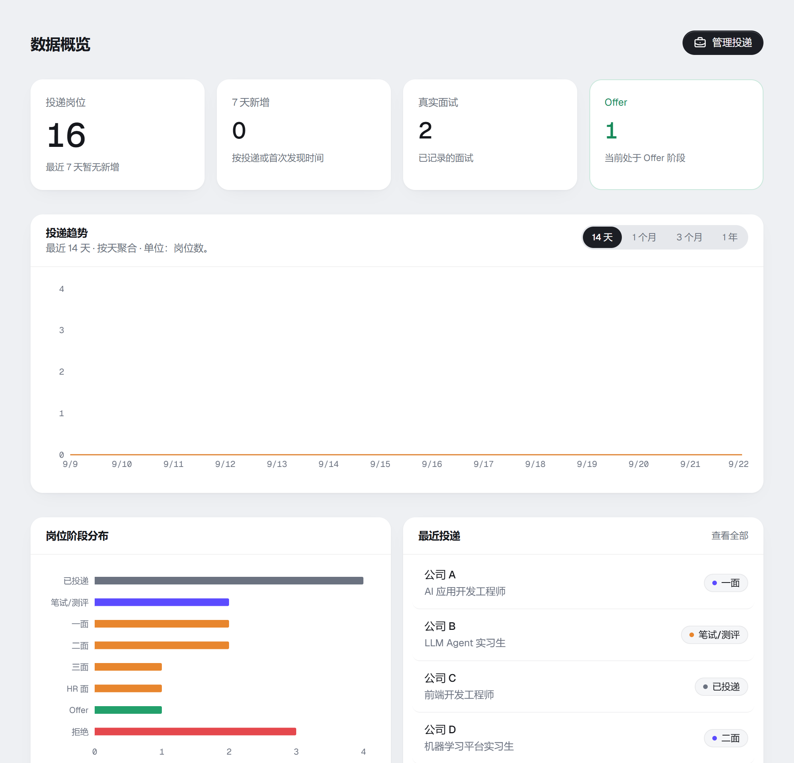
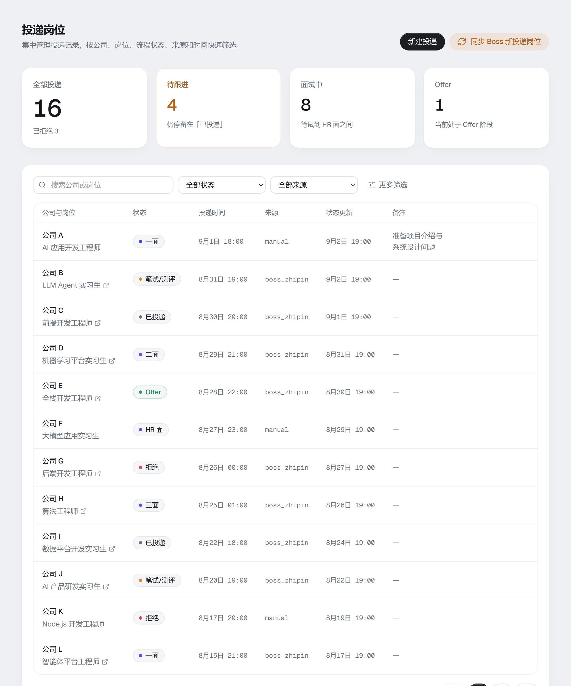
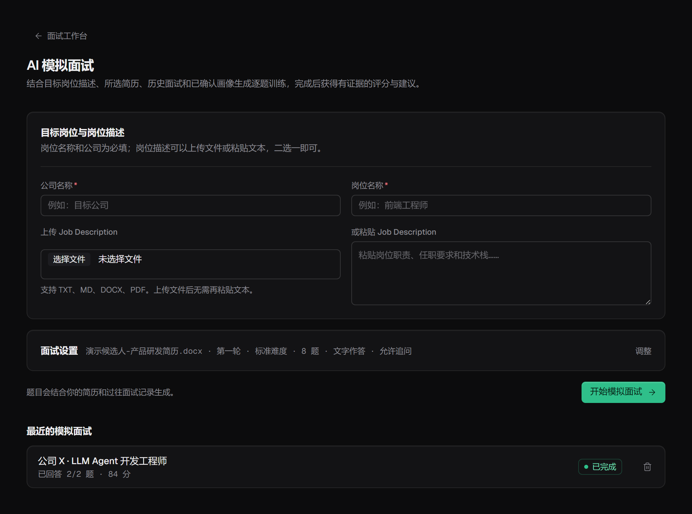
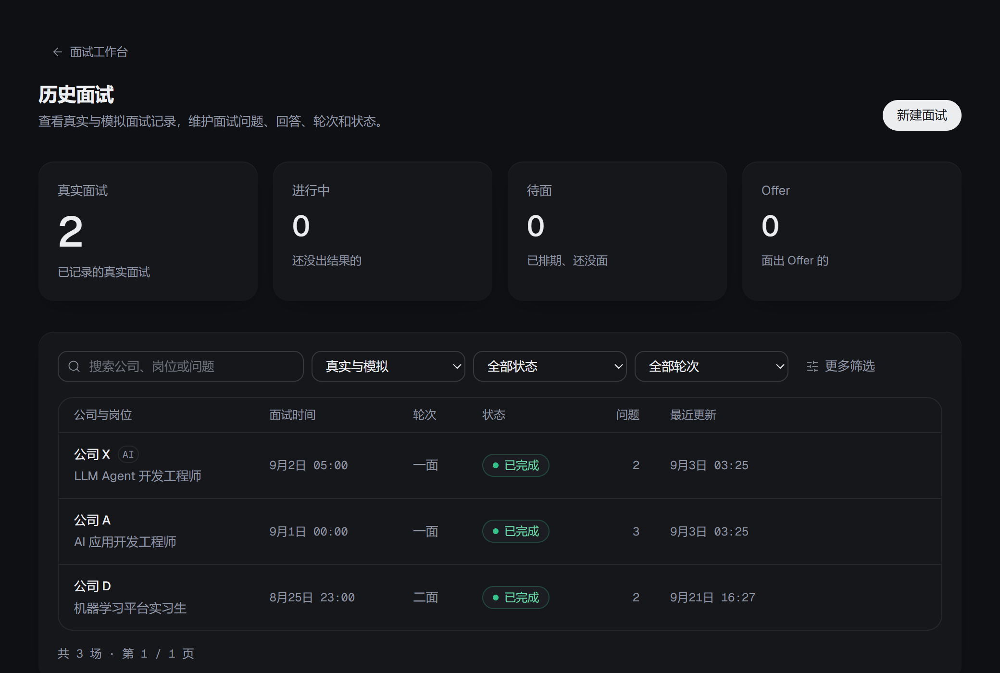
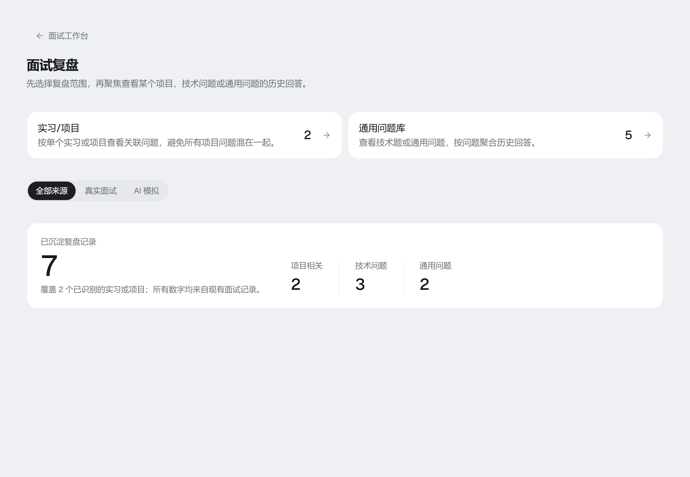
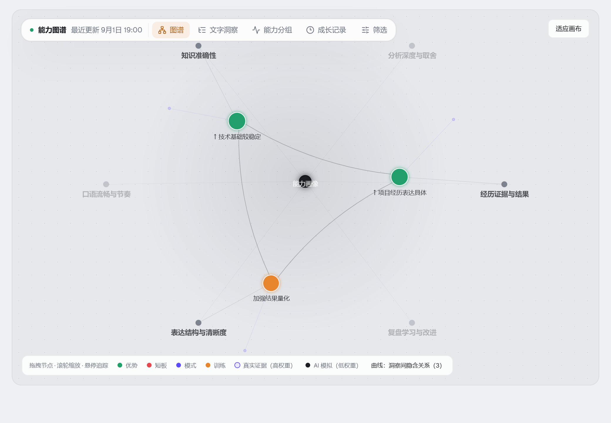

<div align="center">

# OfferLai

**A local-first workspace for managing your complete job-search journey.**

[简体中文](README_CN.md) · [Product Site](https://offer-lai.vercel.app) · [Live Preview](https://offer-lai.vercel.app/homepage)


[Introduction](#introduction) · [Preview](#project-preview) · [What's New](#whats-new) · [Highlights](#feature-highlights) · [Quick Start](#quick-start)

</div>

## Introduction

OfferLai brings job applications, resumes, real interviews, AI mock interviews, interview reviews, and capability profiles into one focused career workspace.

> **Local-first by design:** SQLite data, resume files, and Boss Zhipin login state stay on your own device. AI providers are contacted only after you explicitly configure a model service.

## Project Preview

The [live preview](https://offer-lai.vercel.app/homepage) uses fictional data in read-only mode. It does not accept or store resumes, interview records, API keys, or Boss Zhipin login information. Use a local deployment for the complete writable product.

<table>
  <tr>
    <td width="50%" align="center"><strong>Dashboard</strong><br></td>
    <td width="50%" align="center"><strong>Applications</strong><br></td>
  </tr>
  <tr>
    <td width="50%" align="center"><strong>AI Mock Interview</strong><br></td>
    <td width="50%" align="center"><strong>Interview History</strong><br></td>
  </tr>
  <tr>
    <td width="50%" align="center"><strong>Interview Review</strong><br></td>
    <td width="50%" align="center"><strong>Capability Profile</strong><br></td>
  </tr>
</table>

## What's New

> A first pass at documenting the current state. The interface itself is still being polished, so this section will be revised again after the frontend work lands.

**Added**

- **Layered interview skill packs.** Interview know-how now lives in `SKILL.md` packs (YAML frontmatter + markdown) following the Agent Skills convention, organised in three layers: a base pack for project deep-dive questioning, domain packs for architecture-level questioning, and stack packs for language-specific depth. Ten packs ship by default (backend/frontend/AI-LLM/CS-fundamentals/algorithms plus Java, Go, React, Vue stacks).
- **Agent-driven skill loading.** Only pack names and descriptions stay in context; the question-generation agent calls a `load_skill` tool to pull the full text of whatever it judges relevant, and loading a stack pack automatically brings in its parent domain pack. If a weaker model never calls the tool, a keyword selector deterministically injects the recommended packs on a retry, so question quality does not depend on tool-calling ability.
- **Unified agent runtime.** A single `runAgent()` entry point wraps every AI call with timeouts, structured output, rescue parsing, retry and degradation policy, error classification, prompt versioning, and structured per-call logging (`runId`, token usage, accept/reject counts).
- **Numbered pagination** across applications, interview history, and review, plus real server-side pagination for interview history.

**Changed**

- **Job descriptions are now a weak signal.** Real-world JDs are often vague or stale, so question generation treats them as a hint about role direction and stack only; skill packs and your resume drive the specifics. Questions also favour technical depth and project probing over generic behavioural prompts.
- **Verification is tiered instead of all-or-nothing.** Hard gates are limited to injection defence, citation authenticity, and write atomicity. Everything else degrades or ranks: the job blueprint has a four-level fallback chain and can no longer fail outright, question counts are a range rather than an exact number, and duplicates, quotas, or weak relevance now lower a question's rank instead of discarding it.
- **Interview import asks nothing.** Media type, whether the recording contains the interviewer, which speaker is the candidate, and transcript-vs-summary are all inferred from the uploaded content; company, role, round, and date are extracted to prefill the form. Recording and recognition run as one action, and long recordings are chunked for upload and transcription.
- **Capability profile reads like coaching.** A qualitative "keep doing this / practise that" card appears from the first interview, levels are shown from one interview onward (marked as preliminary), the eight dimensions are grouped into content / evidence / delivery, and insights must land on something actionable.
- **Voice answers** can now run up to 10 minutes.

## Feature Highlights

| Area | Capabilities |
| --- | --- |
| **One-click Boss Zhipin import** | From the applications page, open a local headed browser and import the account owner's existing records across all available pages. OfferLai retries after manual login, deduplicates stable job identities, highlights new or changed records, and only evaluates the 30-day no-activity rejection rule during a sync. It never applies or sends messages for you. |
| **Skill-pack driven AI interviews** | Question generation is grounded in layered `SKILL.md` packs that encode how each domain is actually interviewed — high-frequency topics, depth ladders, good-versus-bad question examples, and project follow-up chains. The agent loads only the packs it needs, with deterministic fallback injection when a model does not call tools. |
| **Memory-grounded AI interviews** | Each mock interview also draws on the selected resume and projects, relevant answers from completed real interviews, and the latest capability-profile insights. Source ranking and duplicate checks keep the injected memory job-specific; the selected context IDs and profile revision are saved for traceability. |
| **Text and voice interview modes** | Let the browser read each question aloud, record an answer of up to ten minutes through the microphone, transcribe it with the configured speech model, and edit the transcript before submission. Raw answer audio is used for transcription only and is not stored. |
| **Continuously evolving capability profile** | Completing a real or mock interview automatically schedules a persistent profile refresh. Versioned assessments and snapshots combine answer evidence, AI feedback, role context, and available delivery metrics, while prioritizing real-interview evidence and supporting later correction or rebuild. |
| **Resume-to-experience indexing** | Upload PDF, Word, or image resumes and extract internships and projects. A confirmation step lets you rename results or link them to existing records before the resume and relationships are committed, reducing duplicate review indexes. |
| **Zero-choice real-interview import** | Create completed interview records manually, or drop in audio, transcripts, summaries, PDF, Word, and text files. OfferLai infers the material type and the candidate's own voice, prefills the interview header, and produces editable question-and-answer drafts with classified and project-linked questions. |
| **Layered interview review** | Review questions by a single internship/project or through technical and general question banks. Repeated questions aggregate historical answers with source interview context, newest first, with server-side filtering and numbered pagination. |
| **Local-first, provider-flexible architecture** | Keep SQLite data, resume files, and Boss browser state on your own machine. Configure text-understanding and speech-to-text providers, models, API keys, and compatible endpoints independently; only configured AI tasks send the required content to a provider. |

## Quick Start

### 1. Live Preview

Open the **[OfferLai live preview](https://offer-lai.vercel.app/homepage)**. This environment is read-only and does not persist changes.

### 2. Local Docker Deployment (Recommended)

**Requirements:** Docker Desktop or Docker Engine with Docker Compose.

```bash
git clone https://github.com/yuecao365/OfferLai.git
cd OfferLai
docker compose up -d --build
```

Open **[http://localhost:3000](http://localhost:3000)**. SQLite data and uploaded files persist in the `offerlai-data` and `offerlai-local` Docker volumes.

```bash
docker compose logs -f offerlai
docker compose down
```

> `docker compose down` preserves the volumes. `docker compose down -v` permanently deletes the local volumes.

### 3. Run from Source

**Requirements:** Node.js 22+, npm, and Chrome or Edge for manual Boss Zhipin login.

```powershell
git clone https://github.com/yuecao365/OfferLai.git
Set-Location OfferLai
Copy-Item .env.example .env.local
npm ci
npm run db:push
npm run dev
```

Open **[http://localhost:3000](http://localhost:3000)**. To use Boss Zhipin synchronization, run locally:

```powershell
npm run boss:login
npm run boss:sync -- --dry-run
npm run boss:sync
```

> Boss Zhipin login, QR codes, CAPTCHAs, and security checks must be completed manually by the account owner. A standard Docker container cannot open a headed browser on the host desktop, so login and sync currently work best when running from source.

## Deployment Notes

OfferLai is designed as a local-first application. Several complete-product workflows depend on long-running tasks or local resources: LLM calls may run for 60 seconds or longer, audio transcription can run for up to 10 minutes, large recordings are chunked and may be split with ffmpeg, mock-interview generation and profile refreshes use Next.js `after()` background work, Boss synchronization drives a local browser over the Chrome DevTools Protocol, and resume files plus browser session state are stored on the local filesystem.

Deploying the writable product to a serverless platform such as Vercel therefore requires your own solutions for function timeouts, an available ffmpeg runtime, durable background execution, and persistent file/database storage. The hosted Vercel site in this repository is a read-only preview. For the complete product, the recommended deployment is local Docker Compose as described above.
