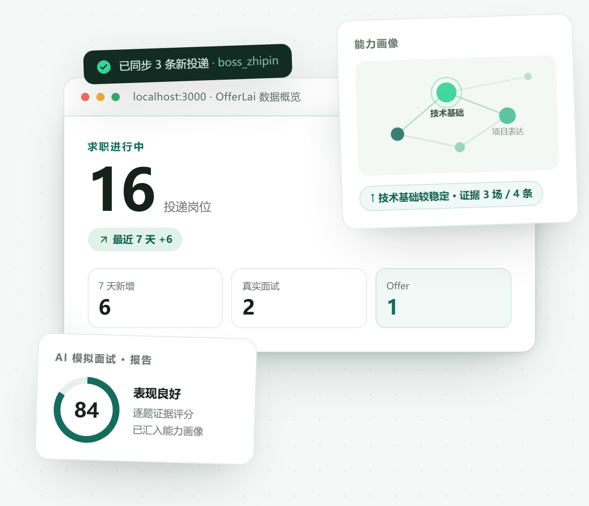

<div align="center">

# OfferLai

**本地优先的求职工作台：让每一次投递和面试，都变成下一次更好的准备。**

[English](README.md) · [产品介绍](https://offer-lai.vercel.app) · [在线体验](https://offer-lai.vercel.app/homepage)


[项目简介](#项目简介) · [项目预览](#项目预览) · [核心闭环](#核心闭环) · [功能介绍](#功能介绍) · [设计与实现](#设计与实现) · [快速开始](#快速开始)

<a href="https://offer-lai.vercel.app/showcase"></a>

</div>

## 项目简介

求职过程中的信息是散的：投递记录留在招聘平台，简历躺在文件夹里，面试经历只存在脑子里，而某次没答好的教训，往往还没到下一场面试就已经忘了。OfferLai 把投递、简历、真实面试、AI 模拟训练、复盘和长期能力画像连成一个工作台，让每一轮的产出都成为下一轮的输入。

> **本地优先设计：** SQLite 数据库、简历文件和 Boss 浏览器登录状态都保存在你自己的设备上。只有在你主动配置模型服务之后才会调用 AI 服务商，并且只发送该任务必需的内容。

## 项目预览

[在线体验](https://offer-lai.vercel.app/homepage)使用虚构数据、以只读模式运行，不接收也不保存简历、面试记录、API Key 或 Boss 登录信息。完整可读写的产品请在本地部署。

<table>
  <tr>
    <td width="50%" align="center"><strong>数据概览</strong><br></td>
    <td width="50%" align="center"><strong>投递岗位</strong><br></td>
  </tr>
  <tr>
    <td width="50%" align="center"><strong>AI 模拟面试</strong><br></td>
    <td width="50%" align="center"><strong>历史面试</strong><br></td>
  </tr>
  <tr>
    <td width="50%" align="center"><strong>面试复盘</strong><br></td>
    <td width="50%" align="center"><strong>能力画像</strong><br></td>
  </tr>
</table>

## 核心闭环

OfferLai 围绕一个闭环设计，每个环节的产出都会让下一个环节更准。

```
投递岗位 ──▶ 简历与项目 ──▶ AI 模拟面试 ──▶ 真实面试
   ▲                            │                │
   │                            ▼                ▼
   └────────── 能力画像 ◀── 复盘与评分 ◀── 导入与转写
```

1. **导入投递记录**，让工作台知道你真正在追哪些岗位。
2. **上传简历**，系统把你的实习与项目整理成可复用的面试素材。
3. **做一场模拟面试**，出题依据是面试技能包、这份简历，以及你过去答过的所有内容。
4. **记录真实面试**，直接投入录音、逐字稿或你自己写的复盘。
5. **按项目或题库复盘**，同一个问题会把你历次的回答聚合到一起对照。
6. **能力画像随之更新**，画像点出的薄弱环节可以一键生成针对性训练。

## 功能介绍

### 投递岗位

一键导入 Boss 直聘上已有的记录：OfferLai 通过 Chrome DevTools Protocol 驱动本机浏览器逐页读取，按稳定岗位身份去重，并突出新增与来源变化。超过 30 天没有后续互动的投递会在同步时被标记为已拒绝——这个判断只在同步过程中发生，不会在你不知情时偷偷改动数据。登录、扫码、验证码和安全校验始终由你本人完成；系统只读取你已有的记录，不会代你投递或发送任何消息。你删除过的岗位不会在下次同步时被重新拉回。投递记录同样支持手动新建与编辑，阶段变化会实时反映到数据概览。

### 简历中心

上传 PDF、Word 或图片简历，系统会提取其中的实习与项目经历。正式保存前有一个确认环节，你可以改名或与已有条目合并，避免复盘索引里出现大量高度相似的项目。解析出来的经历会成为模拟面试和项目深挖题的素材来源。

### AI 模拟面试

每一场的题目都由**面试技能包**（见下文）、所选简历与项目、历史面试中的相关问答，以及当前的画像洞察共同生成，而不是从通用题库里随机抽题。考虑到现实中的岗位描述往往宽泛或长期未更新，JD 只被当作判断岗位方向和技术栈的参考，而不是事实来源。

作答方式可选文字或语音：浏览器朗读题目，麦克风最长录制 10 分钟，由你配置的语音模型转写，提交前还能编辑转写文本。回答音频只用于本次转写，不会保存原始音频。当回答留下明显缺口时面试官会追问；不想答的题也可以跳过。

每道题都用出题时一并生成的评分标准来评分，保证不同回答之间的尺度一致。报告包含总分、逐题证据、优势、改进方向、行动计划，以及本场有多少题直接来自岗位描述、多少题来自岗位通用要求。

### 历史面试与导入

既可以手动记录一场已完成的面试，也可以直接把手上的材料投进来：录音、逐字稿、复盘总结、PDF、Word 或纯文本。剩下的事情交给系统判断——文件是音频还是文本、录音里有没有面试官、哪位说话人是你、文本是逐字记录还是事后总结。公司、岗位、轮次和面试时间也会被提取出来预填表单。录音的转写与问题识别合并为一次操作，超长录音会自动分片上传与转写。识别结果以可编辑的草稿呈现，问题会被自动分类并关联到对应项目，在你确认之前不会写入任何数据。

面试时间在未来的记录会成为备战目标：专门的备战页会集中呈现这家公司过去问过的问题，以及你当前较弱的能力方向。

### 面试复盘

你可以只看某一个实习或项目相关的问题，也可以进入技术八股或通用问题库。重复出现的问题会被合并（包括措辞相近的变体），于是同一个问题在不同公司的历次回答会并排展示，最新的在前，并附带来源面试信息。筛选与分页都在服务端完成，任何一条已回答的问题都可以一键再练。

### 能力画像

无论真实面试还是模拟面试，完成后都会在后台安排一次画像更新。从第一场面试开始，你就能看到"继续保持"与"值得再练"的定性反馈卡，其中每个薄弱点都可以直接跳转到针对性训练。随着证据积累，八个能力维度——归入**内容力**、**证据力**、**表达力**三组——会逐步获得等级、趋势与置信度，其中真实面试的权重高于模拟面试，近期证据的权重高于陈旧证据。

洞察以教练口吻书写而非下判决书：每一条都必须落到可执行的动作上，并由你自己回答中的逐字摘录支撑。你可以查看任何一条洞察背后的证据，排除你不认同的证据、调整维度归属，或锁定某条洞察让后续刷新不再改动它。口语表达由语音指标计算得出，而不是从文字里猜测；当无法可靠判断哪段录音是你的声音时，这一维度会直接留空而不是给出错误数据。

## 设计与实现

一些决定了产品行为的设计选择：

**分层面试技能包。** 面试经验被沉淀为 `SKILL.md` 文件——YAML frontmatter 加 markdown 正文，遵循 Agent Skills 约定——并按三层组织：**基座层**负责项目深挖追问法，**领域层**负责架构类出题方法论，**技术栈层**负责语言特有的考察深度。默认内置 10 个技能包（后端、前端、AI/LLM、计算机基础、算法，以及 Java、Go、React、Vue 四个技术栈）。每个包中都写明了高频主题、深度阶梯、好题与坏题对照，以及项目追问链——这正是让生成的题目足够具体、而不是"谈谈你对 X 的理解"的原因。

**渐进式披露，并带兜底网。** 常驻 agent 上下文的只有技能包的名称和描述；出题时由 agent 调用 `load_skill` 工具自行加载它判断需要的全文，加载技术栈包会自动带上所属领域包。如果模型能力较弱、全程没有调用工具，系统会按关键词推荐结果做一次确定性注入并重试——出题质量不依赖模型是否会用工具。

**可验证的生成。** 模型只负责提出，程序负责裁决。引用必须真实：声称引自岗位描述的能力项会与原文逐字核对，画像证据必须在你的回答原文中真实出现。所有模型读到的内容——岗位描述、简历、你的回答、网页结果——都被视为不可信数据，其中夹带的指令一律忽略。

**分级校验，绝不让你空手而归。** 硬性拦截只保留三类：提示词注入防护、引用真实性、写入原子性。其余一律改为降级或排序而非拒绝：岗位分析具备四级兜底链、不存在彻底失败的路径；题目数量是一个区间而非固定值；重复或相关性偏弱只会降低题目的排序，而不是把它丢掉。确实无法产出时，产品会说明它改为做了什么，而不是甩给你一个死胡同。

**统一的 agent 运行时。** 所有 AI 调用都经过同一个 `runAgent()` 入口，统一处理超时、结构化输出、截断响应的抢救解析、重试与降级策略、错误分类、提示词版本，以及带 token 用量和采纳／拒绝计数的结构化日志。

**模型服务可自由搭配。** 文本理解与语音转写分别配置服务商、模型、API Key 和自定义 OpenAI 兼容接口地址，因此你可以用强推理模型配便宜的转写模型，也可以两者都指向本地服务。只有你配置过的 AI 任务才会向外发送数据。

## 快速开始

### 1. 在线体验

直接打开 **[OfferLai 在线体验](https://offer-lai.vercel.app/homepage)**。该环境只读，操作不会被保存。

### 2. Docker 本地部署（推荐）

**环境要求：** Docker Desktop 或 Docker Engine + Docker Compose。

```bash
git clone https://github.com/yuecao365/OfferLai.git
cd OfferLai
docker compose up -d --build
```

打开 **[http://localhost:3000](http://localhost:3000)**。SQLite 数据与上传文件持久化在 `offerlai-data` 和 `offerlai-local` 两个 Docker 卷中。

```bash
docker compose logs -f offerlai
docker compose down
```

> `docker compose down` 会保留数据卷；`docker compose down -v` 则会永久删除它们。

### 3. 源码运行

**环境要求：** Node.js 22+、npm，以及用于 Boss 登录的 Chrome 或 Edge。

```powershell
git clone https://github.com/yuecao365/OfferLai.git
Set-Location OfferLai
Copy-Item .env.example .env.local
npm ci
npm run db:push
npm run dev
```

打开 **[http://localhost:3000](http://localhost:3000)**，并在使用任何 AI 功能前先到**设置**页配置模型服务。Boss 直聘同步：

```powershell
npm run boss:login
npm run boss:sync -- --dry-run
npm run boss:sync
```

> Boss 登录、扫码、验证码与安全校验必须由账号本人手动完成。标准 Docker 容器无法在宿主机桌面打开有头浏览器，因此登录与同步在源码运行方式下体验最好。

## 部署说明

OfferLai 按本地优先方式设计。多项能力依赖长任务或本地资源：LLM 调用可能持续 60 秒以上；音频转写最长可运行 10 分钟；超长录音会分片并可能需要 ffmpeg 切分；模拟面试生成与画像刷新使用 Next.js `after()` 后台任务；Boss 同步通过 Chrome DevTools Protocol 驱动本机浏览器；简历文件与浏览器会话状态保存在本地文件系统。

因此，若要把可读写的完整产品部署到 Vercel 等 serverless 平台，需要你自行解决函数超时、ffmpeg 运行环境、可靠的后台任务，以及数据库与文件的持久化存储。本仓库中的 Vercel 站点仅作为只读预览；完整产品请按上文使用 Docker Compose 在本地运行。
