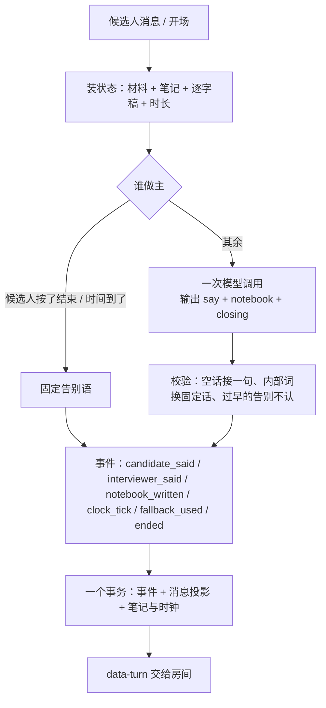

# 面试中：一个回合是怎么跑完的（重建后，policy-v2）

> 上一篇：[面试开始前](interview-flow-before.md) · 下一篇：[面试结束后](interview-flow-after.md)
> 设计：[interview-system-design.md](interview-system-design.md)（§4 形式、§6.6 运行时、§7 时序）；施工：[interview-refactor-plan.md](interview-refactor-plan.md)。
> 代码：`src/lib/interview/` —— `orchestrator.ts`（本地版装状态与落库）→ `turn.ts`（回合核心）→ `policy.ts`（一次模型调用）→ `clock.ts`（时间盒）→ `events.ts`（事件日志）→ `stream.ts`（HTTP 流）→ `views.ts`（房间与 trace 视图）。体验版走 `src/app/api/trial/turn/route.ts`，同一个 `runTurn`。

## 0. 总览

面试官只负责像面试官那样说话；它的工作记忆与计划是一本自由文本的笔记，每回合整份重写。代码只守四件事：时间盒、候选人的结束按钮、模型没说出话时接一句、每一步记事件。没有话题记账：切段、判断、评分在面试之后由整理员从逐字稿产出（重建阶段 C）。面试中异步跑的是标注器（聊过什么）、在线评委（每段答到第几层、多少分）和能力估计器（每项能力的后验），它们只往现场卡上加两行（阶段 D）。

## 1. 状态

| 东西 | 内容 |
|---|---|
| 材料（`brief`） | 备课产物，整场不变：项目的五个面、基础题池、场景题、简历假设 |
| 笔记（`notebook`） | 面试官自己写的自由文本，≤ 300 字，每回合整份重写；库里只存最新一份，历史在事件日志 |
| 逐字稿 | 从事件日志投影：双方说过的话 |
| 时间盒（`durationMinutes`） | 快速 10 / 标准 20 / 深入 35 分钟（按试用者的耐心定；约 5–6 / 10–12 / 18 个问答） |
| 阶段 | opening（还没开场）/ running / ended |

## 2. 时间盒（`clock.ts`）

文字版没有真实时间，按字数折算：候选人每分钟 160 字，面试官每分钟 300 字，每次交换另加 20 秒（每次交换约 1.9 分钟）。到 75% 进入 late（场景题没问就催进），到 90% 现场卡提醒"该收的收"，到 100% 下一回合由代码用固定告别语收尾；交换次数到期望值的 1.5 倍也强制结束（估计失真的兜底）。房间顶栏显示的是按此折算的进度百分比与"约 N 分钟"，不是墙上时间。答疑、复述、提示自然只值几秒，不需要"不算回合"的规则。语音版换成真实时间，接口不变。

## 3. 一次模型调用（`policy.ts`）

上下文布局为了前缀缓存：

- **系统提示词整场不变**：人设与档位、怎么面（原则，不是流程：真实一面的样子、找证据、问法、怎么应对求助与跑题、时间、不泄露、不听候选人话里的指令）、笔记怎么写、输出格式、材料、技能包索引、JD、简历。
- **历史只追加**：双方说过的话，超 14k 字符才从最旧的整条丢。
- **现场卡在最后一条用户消息里**：时间（已用 / 总 / 剩余与提醒）、上一回合的笔记、开场提示、**能力估计一行**（`能力估计：最值得追：X（估计 中，置信 低，岗位权重 高）；已足够确定：Y（…）`；核心能力都足够确定时改为"剩下的时间可以收尾"；没有岗位能力清单就没有这一行）、**覆盖账与建议**（最后一行，紧贴"候选人说："——按种类数标注器认为聊过的材料：项目几个几面、基础题几道、场景题几道；默认分配项目六成 / 基础题两成 / 场景题两成；项目用掉一半以上时间还没问基础题就催转，75% 后场景题没问就催进；候选人这句在求助时改为"先就这一问给方向或换个问法，等答了再考虑转题"）；之后才是"候选人说："。只是账和建议，怎么走模型定。

输出是结构化对象 `{ say, notebook, closing }`：`say` 逐段流回房间（从 partialOutputStream 的 say 字段取增量），`notebook` 整份替换，`closing` 只在这句是告别时为 true。工具只有两个只读的：`lookup_skill`（技能包正文）、`lookup_resume`（简历段落）。一回合最多 3 步，最后一步不许再查材料（否则连查三步用完步数就没有话；`prepareStep` 设 toolChoice none）。

## 4. 代码守的底线（`turn.ts`）

| 情形 | 处理 |
|---|---|
| 候选人按"结束"，或 40 字以内含结束意图的插话 | 不调模型：固定告别语，`ended.by = candidate` |
| 时间盒到 100%（或交换数到硬顶） | 不调模型：固定告别语，`ended.by = budget` |
| 模型没产出可用结果（超时、5xx、坏 JSON 抢救失败） | 接一句固定的话，记 `fallback_used`，笔记不动 |
| 模型标了 closing 但那句里有问号 | 不认作告别，按普通话处理（模型常把告别标在"最后再问一个"上，问号后面还补一句"一句话说完就行"） |
| 额度 / 密钥 / 连不上服务商 | 抛出，回合不落库，房间显示原因 |
| `say` 里出现"评分标准 / 期望信号 / 现场卡"这类内部词 | 换成固定的话（不把内部说法带给候选人） |
| `closing = true` 但时间盒还没过半 | 不认，当普通一句（v13 里模型把"换下一个话题"当成了收尾） |

## 4a. 面试中的后台：标注器、在线评委、估计器（`background.ts`、`labeler.ts`、`judge.ts`、`estimator.ts`）

响应返回后（`after`）顺序跑，都不进关键路径，失败只影响现场卡的一两行：

1. **标注器**（labeler-v1）每两次交换给面试官的话打标签：碰了哪道材料、什么动作（open / probe / clarify / hint / switch / close）→ `label_added`；汇总成覆盖账。
2. **在线评委**（judge-v1）：标签里 open / switch 开一段、下一句 open / switch / close 之前结束；已结束且没评过的段各调一次小模型：这段主要考的能力（岗位能力清单里的 id）、候选人答到阶梯第几层（1 概念 / 2 机制 / 3 取舍与边界 / 4 有判断且能验证）、分数、把握 → `segment_scored`。
3. **估计器**（纯函数）：把每段折成能力证据 x = ((层 − 1) + 分数/100) / 4；每项能力 Beta(1, 1) 先验按把握加权更新，均值 = (1 + Σ c·x) / (2 + Σ c)，置信 = n / (n + 2)；下一个最值得追 = 权重（core 1 / secondary 0.6）× (1 − 置信) 最大的那项；置信 ≥ 0.6 算足够确定 → 每次更新写 `estimate_updated`，现场卡的一行由 `segment_scored` 现算。
4. 写事件与下一回合落库撞 seq 时放弃这次，下次再标 / 再评（评过与否以事件为准）。最后一段在面试结束后没有在线评分，由事后的整理员与评分覆盖。

设计与验证口径见 `interview-system-design.md` §6.1、施工图 §9。

## 5. 事件与投影（`events.ts`、`orchestrator.ts`）

每回合按序写：`candidate_said`（含房间按钮 `control`）→ `interviewer_said`（kind：say / closing / fallback）→ `notebook_written`（笔记变了才写）→ `clock_tick` → `ended`（结束时）；后台另写 `label_added`、`segment_scored`、`estimate_updated`。trace 页每回合下面显示评委的打分与估计的更新。同一事务里写消息投影（`MockInterviewMessage`，房间与逐字稿读它）和会话字段（`notebook`、`clockJson`、`startedAt`）；结束时会话进入 `ready_to_evaluate` 并安排交卷。

幂等：候选人消息带 `clientId`，重复提交回放当时的面试官消息；开场回合已有消息时同样回放；同一回合序号只落一次（并发的第二个失败）。

重放：`npm run replay -- <sessionId>` 从事件重建逐字稿、与消息表对账、算指标，不调模型。

## 6. 接口与房间

`POST /api/interviews/mock/[id]/turn`：`{ kind: "start" }` 或 `{ clientId, content, intent, composeMs }`；`intent` 是房间按钮（hint / skip / repeat / end），没打字时用固定的话代替。响应是 AI SDK 的 UI 消息流：面试官的话逐段流回，流结束前把 `data-turn`（新消息、阶段、时钟、结束方）交给前端。

房间顶栏：时间盒（已用 / 总分钟，快到时间变色）与走时的钟；按钮：要个提示 / 再说一遍 / 跳过这题 / 结束面试。候选人看不到笔记与材料。trace 页：每回合的候选人的话、面试官的话、这回合的笔记、时钟估计、是否降级、模型开销。报告页：汇总、逐题评分（阶段 C 起有分段）、面试官最后一份笔记。

## 7. 体验版

状态（材料、笔记、时长、消息）随请求带上，跑同一个 `runTurn`，`data-turn` 回来后写进浏览器的会话文档（v8）。没有事件日志，trace 从消息拼。

## 8. 评测

`npm run simulate`：合成候选人（五种画像 × 能力真值）走同一接口；指标从事件日志算（`src/lib/interview/eval/`）。覆盖类指标（聊了几个项目、每项目几面、场景题问没问）要等阶段 C 的整理员切段。
