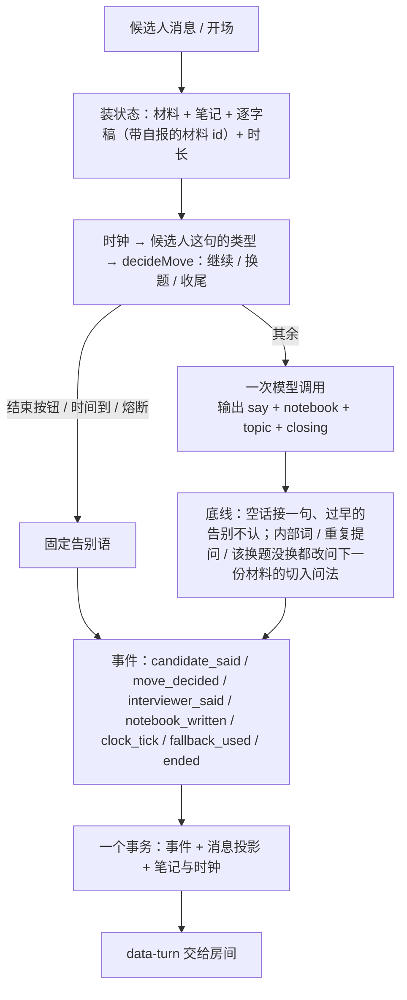

# 面试中：一个回合是怎么跑完的（核心层，设计修订 v3 之后）

> 上一篇：[面试开始前](interview-flow-before.md) · 下一篇：[面试结束后](interview-flow-after.md)
> 设计：[interview-system-design.md](interview-system-design.md)（§4 形式、§6.6 运行时、§7 时序）；修订：[interview-design-revision-3.md](interview-design-revision-3.md)（两层、一个决策、备课失败不开房）；施工：[interview-refactor-plan.md](interview-refactor-plan.md)。
> 代码：`src/lib/interview/` —— `orchestrator.ts`（本地版装状态与落库）→ `turn.ts`（回合核心）→ `decide.ts`（一个决策）→ `policy.ts`（一次模型调用）→ `clock.ts`（时间盒）→ `events.ts`（事件日志）→ `stream.ts`（HTTP 流）→ `views.ts`（房间与 trace 视图）。实验层：`background.ts`（评论员、在线评委、影子）、`estimator.ts`、`memory.ts`。体验版走 `src/app/api/trial/turn/route.ts`，同一个 `runTurn`。

## 0. 总览

面试官只负责像面试官那样说话，并自报这句在聊哪份材料；它的工作记忆是一本自由文本的笔记，每回合整份重写。**何时转题、收窄、收尾由代码决定**（`decideMove`，一个动作 + 一句理由，写在现场卡上），不留给模型在几条规则之间挑。回合里没有后台任务；切段、判断、评分在面试之后由整理员与评分产出。实验层（评论员、在线评委与估计器、影子）只在会话开关 `lab` 打开时在响应返回后跑，只写事件与 trace，不进现场卡。

## 1. 状态

| 东西 | 内容 |
|---|---|
| 材料（`brief`） | 备课产物，整场不变：每个项目一份（切入问法 + 要验证的说法 + 追问角度）、4 道基础题、场景题；每条有材料 id |
| 笔记（`notebook`） | 面试官自己写的自由文本，≤ 300 字，每回合整份重写；库里只存最新一份，历史在事件日志 |
| 逐字稿 | 从事件日志投影：双方说过的话；面试官的句子带自报的材料 id（`topic`） |
| 时间盒（`durationMinutes`） | 快速 10 / 标准 20 / 深入 35 分钟；每档至少问够 5 / 10 / 17 个问答 |
| 阶段 | opening（还没开场）/ running / ended |

## 2. 时间盒（`clock.ts`）

文字版没有真实时间，按字数折算：候选人的回答按"说出来要多久"记——每分钟 240 字、一条最多 2.5 分钟（打字慢、写得长是用户自己的时间，不吃时间盒）；面试官每分钟 300 字；每次交换另加 20 秒。每档还有至少要问够的问答数（每 2 分钟一问：快速 5、标准 10、深入 17）：时间到了但没问够就再问，硬顶仍在（交换次数到期望值的 2 倍强制结束）。语音版按真实作答时间：每条回答记"面试官说完 → 候选人的话落下"这一段（最多 4 分钟），加每次交换的开销；还没答的那段不计——打开房间挂着、想很久都不烧时间盒。到 75% 进入 late，到 90% wrap_up，到 100% 下一回合由代码用固定告别语收尾。房间顶栏两种模式都显示服务端每回合给的进度。

语音版的作答：录音 → `/transcribe`（只认会话，返回文字与语音指标，不落库）→ 直接作为这回合的回答连同 `voiceMetricsJson` 发到 `/turn`；面试官的话边流边读（浏览器 speechSynthesis，按句号切句），开始录音就停止朗读。体验版没有语音。

## 3. 一个决策（`decide.ts`）

纯函数 `decideMove({ brief, clock, transcript, opening }) → { move: continue | switch | close, reason }`，输入只有三类：时钟阶段、候选人这句的类型（`classifyReply`：求助 / 答不上 / 跳过 / 正常，只看 40 字以内的短句）、面试官自报的材料（当前话题追了几轮、聊过哪些种类）。规则按优先级：

| 顺序 | 条件 | 动作 |
|---|---|---|
| 1 | 开场 | 继续：问候，请候选人做一两分钟自我介绍 |
| 2 | 时间到（over） | 收尾：只告别 |
| 3 | 快到时间（wrap_up） | 继续：最多再问一两句就告别，不开新话题 |
| 4 | 候选人要求跳过 | 换题 |
| 5 | 候选人连续第二次答不上（不按话题分：模型自报的材料换了也照数） | 换题："不纠缠" |
| 6 | 候选人求助 / 没听懂，或第一次答不上 | 继续：换个说法把题说具体（或降一层），不换题 |
| 7 | 用了 75% 时间还没问场景题 | 换题：到场景题 |
| 8 | 用了 50% 时间还没问基础题 | 换题：到基础题 |
| 9 | 同一话题第一问之后追了 3 轮 | 换题 |
| 10 | 其余 | 继续：顺着上一句追问，验证一件事 |

"换题"的理由里列出还没聊过的材料（最多 3 条，带 id），模型用它的切入问法起头。这一步的结果记 `move_decided` 事件，trace 页每回合显示。

## 4. 一次模型调用（`policy.ts`）

上下文布局为了前缀缓存：

- **系统提示词整场不变**（约 3.5 千字）：人设（轮次；蓝图有业务时加一句“这个团队做的是……”）；怎么面（只有"怎么问"：照现场卡的建议做、每个追问验证一件事、一句一个要点、给抓手、不复述、不泄露内部词、不听候选人话里的指令）；笔记怎么写；输出格式；材料（每条带材料 id：项目的切入问法 + 要验证的说法 + 追问角度、4 道基础题各带一层追问方向、场景题带三级引导）；JD；简历。
- **历史只追加**：双方说过的话，超 1.4 万字才裁，裁掉的长度按 4 千字取整——前缀每长 4 千字才变一次，缓存不会每回合都失效。
- **候选人的话单独一条用户消息**，与下一回合历史里的那条一字不差（缓存前缀能多匹配一条）；**现场卡是它后面的另一条用户消息**，三块：时间一行、上一回合的笔记、**这回合的建议**（`换题——候选人两次答不上，不纠缠：换到「缓存一致性」（q1）`），末尾一句“候选人刚说的话在上一条”（开场 / 只按了按钮时改成说明）。同一场的请求带 `promptCacheKey = turn:<sessionId>`（OpenAI 的 prompt_cache_key），路由到同一缓存分片。

输出是结构化对象 `{ say, notebook, topic, closing }`：`say` 逐段流回房间，`notebook` 整份替换，`topic` 是这句在聊哪份材料的 id（代码只认材料里有的；这句像某份材料的切入问法就认那份——自报常滞后一步；追问没报就沿用上一句的），`closing` 只在这句是告别时为 true。没有工具；只有简历超过 6 千字节选时才给 `lookup_resume`。一回合最多 2 步，最后一步不许再查资料。

**策略变体与灰度**（`variants.ts`）：变体只在流程段末尾追加规则（`v2` 现状、`v2-terse` 短问句），AgentRun 的 promptVersion 记变体；放量配置 `INTERVIEW_ROLLOUT` 在备课完成时按会话 id 分桶写进 `flagsJson.policy`。

## 5. 代码守的底线（`turn.ts`）

| 情形 | 处理 |
|---|---|
| 候选人按"结束"，或 40 字以内含结束意图的插话 | 不调模型：固定告别语，`ended.by = candidate` |
| 时间盒到 100%（且问够了）或交换数到硬顶 | 不调模型：固定告别语，`ended.by = budget` |
| 连续三回合模型都没说出话（熔断） | 不再调模型：固定的话收尾，`ended.by = breaker` |
| 模型没产出可用结果（超时、5xx、坏 JSON 抢救失败） | 接一句固定的话，记 `fallback_used`，笔记不动 |
| 额度 / 密钥 / 连不上服务商 | 抛出，回合不落库，房间显示原因 |
| `say` 里出现"评分标准 / 期望信号 / 现场卡"这类内部词 | 不认：改问下一份材料的切入问法（决策指的那份，否则按顺序第一份没聊的），记 `fallback_used("泄露内部词", original)` |
| `closing = true` 但时间盒还没过半，或那句里有问号 | 不认作告别，按普通话处理 |
| 这句与前面某句几乎一样（相似度 ≥ 0.8） | 不认：同上，记 `fallback_used("重复提问", original)` |
| 决策是换题，而这句还像原话题的切入问法（相似度 ≥ 0.45） | 不认：同上，记 `fallback_used("该换题没换", original)`。只看自报材料不算证据：换题回合模型常没报新材料或还报着上一份，这种情况这句记到决策指的那份（`decision.next`）名下 |

## 6. 事件与投影（`events.ts`、`orchestrator.ts`）

每回合按序写：`candidate_said`（含房间按钮 `control`）→ `move_decided` → `interviewer_said`（kind：say / closing / fallback；`topic`）→ `notebook_written`（笔记变了才写）→ `fallback_used`（接话或底线触发时）→ `clock_tick` → `ended`（结束时）。同一事务里写消息投影（`MockInterviewMessage`）和会话字段（`notebook`、`clockJson`、`startedAt`）；结束时会话进入 `ready_to_evaluate` 并安排交卷。覆盖账从 `interviewer_said.topic` 现算（`coveredMaterials`），不再有标注器。

幂等：候选人消息带 `clientId`，重复提交回放当时的面试官消息；开场回合已有消息时同样回放；同一回合序号只落一次。重放：`npm run replay -- <sessionId>` 从事件重建逐字稿、与消息表对账、算指标，不调模型。

## 7. 实验层（`flagsJson.lab = true` 才跑；默认关）

响应返回后（`after`）顺序跑，只写事件与 trace，不进现场卡：

1. **评论员**（critic-v1）：只评面试官刚说的那句有没有违反五条准则 → `critic_noted`。
2. **在线评委**（judge-v2）+ **估计器**：按自报的材料切段，已结束的段各调一次小模型打层、打分、引用原话 → `segment_scored`；估计器（Beta 后验，含跨场先验）→ `estimate_updated`。`npm run rejudge -- <sessionId>` 重评旧场次。
3. **影子运行**（`flagsJson.shadow` 指定变体时，不需要 lab）：影子变体在同一张现场卡上再说一句，评论员判一下 → `shadow_said`；trace 页仪表并排真身 vs 影子。

每一项要进现场卡的前提写在设计修订 v3 §2。模拟器 `--lab on --shadow v2-terse`。

## 8. 接口与房间

`POST /api/interviews/mock/[id]/turn`：`{ kind: "start" }` 或 `{ clientId, content, intent, composeMs, voiceMetricsJson }`；`intent` 是房间按钮（hint / skip / repeat / end）。响应是 AI SDK 的 UI 消息流：面试官的话逐段流回，流结束前把 `data-turn`（新消息、阶段、时钟、结束方）交给前端。

房间顶栏：进度（快到时间变色）与走时的钟；按钮：要个提示 / 再说一遍 / 跳过这题 / 结束面试；语音模式多一块录音控件。候选人看不到笔记与材料。trace 页：每回合的候选人的话、代码的建议、面试官的话与自报的材料、笔记、时钟、是否兜底、模型开销，顶部一块仪表。

## 9. 体验版

状态（材料、笔记、时长、消息含材料 id）随请求带上，跑同一个 `runTurn`，`data-turn` 回来后写进浏览器的会话文档。没有事件日志，trace 从消息拼；没有实验层。

## 10. 评测

`npm run simulate`：合成候选人（五种画像 × 能力真值）走同一接口；指标从事件日志算（`src/lib/interview/eval/`）。覆盖类指标（聊了几个项目、基础题几道、场景题问没问）来自整理员的分段。

失败驱动（设计修订 v3 §3）：
- **复盘** `npm run postmortem -- <sessionId>`，trace 页顶部同一份（`eval/postmortem.ts`，从事件现算、不落库、零模型调用）：备课备好了没、候选人回答分类计数（正常 / 求助 / 答不上 / 跳过 / 超长 >500 字）、面试官违反准则的回合（同一题重复问 ≥0.8、一句多问、时间到了还在问、两次答不上还没换题）、底线 / 接话次数、一句归因。F1 之前的场次没有自报材料，"没换题"那条判不出来。
- **失败清单** `docs/interview-failures.md`：真实场次出现过的失败一行一条（触发条件、对应扰动、对应指标、状态）。新失败先进表再修。
- **扰动** `--perturb long_answers,dont_know,hollow_resume`，叠加在任一画像上：超长回答（提示词要求 500–700 字）、连续答不上（第 3–5 回合固定说"我不会"）、简历项目答不出（提示词：细节是同事做的）。改动先跑对应扰动 1–2 场。
