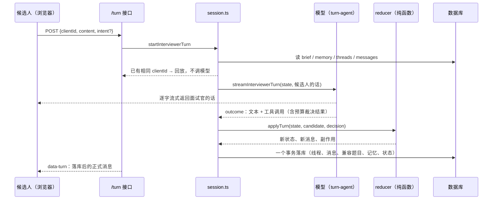

# 面试中：一个回合是怎么跑完的

> 上一篇：[面试开始前](interview-flow-before.md) · 下一篇：[面试后](interview-flow-after.md)
> 代码：`src/app/api/interviews/mock/[id]/turn/route.ts`（接口）→ `interviewer/session.ts`（装配与落库）→ `turn-agent.ts`（模型回合）→ `prompt.ts`（提示词）→ `reducer.ts`（裁决）→ `budget.ts`（预算）→ `memory.ts` / `segments.ts` / `state.ts`。前端 `components/interviews/mock-interview-chat.tsx`。

## 0. 总览



## 1. 定义

### 1.1 状态（`InterviewerState`，每回合从数据库重建，纯内存对象）

```
brief      冻结的简报（见上一篇）
memory     工作记忆 { established[], doubtful[], failed[], hypotheses[{id,status,note}] }
threads[]  { id, areaId, entryQuestion, status: active|closed|skipped,
             depth, rescues, openedAtTurn, closedAtTurn, note }
messages[] { id, turnIndex, role: interviewer|candidate, kind, content, threadId, toolName }
turnIndex  下一回合序号 = 已有消息里最大 turnIndex + 1
phase      opening（还没有消息）| running | ended（会话状态不再是 in_progress）
idleTurns  连续没有推进动作的回合数
```

**回合**：候选人一条消息 + 面试官一次回应，共用同一个 `turnIndex`。开场回合没有候选人消息。

**线程**：在一个领域内从切入问题到收住的一段连续问答。同一时刻最多一条 active。每个领域最多 2 条线程（第二条用于跳过后回访或补问）。

**消息 kind**：

| role | kind | 何时产生 |
|---|---|---|
| interviewer | intro_request | ask_intro |
| interviewer | question | open_thread（含代码兜底开线程） |
| interviewer | probe | probe |
| interviewer | rescue | rescue |
| interviewer | closing | close_interview（含被迫收尾） |
| interviewer | aside | 模型只说话没动作 |
| candidate | answer | 有 active 线程时的发言（归入线程） |
| candidate | aside | 没有线程时的发言（自我介绍、插话） |

### 1.2 预算（`budget.ts`，代码持有，模型改不了）

| 常量 | 值 | 作用 |
|---|---|---|
| turnRange（来自简报） | quick 6–10 / standard 12–20 / deep 22–32 | 下限前不许 close_interview；到上限禁止 open/probe/rescue，只能收尾 |
| probeLimit(area) | min(4, area.depth + 1) | 线程内追问层数上限 = 目标深度 + 1 层余量 |
| RESCUES_PER_THREAD | 1 | 每线程一次提示 |
| THREADS_PER_AREA | 2 | 每领域线程数 |
| IDLE_TURNS_BEFORE_FORCE | 2 | 连续无动作回合数，到了代码强制推进 |

`canAct(state, action)` 逐条判断：

| 动作 | 拒绝条件（任一） |
|---|---|
| ask_intro | 不在开场；简报 askIntro=false |
| open_thread | 有 active 线程；到上限；areaId 不在简报；该领域线程数已达 2 |
| probe | 无 active；到上限；depth ≥ probeLimit |
| rescue | 无 active；到上限；rescues ≥ 1 |
| close_thread | 无 active |
| close_interview | 未到下限，且（有 active 线程 或 还有可开的领域） |

### 1.3 工作记忆（`memory.ts`）

模型通过 `note` 工具提交增量：`{ established[≤5], doubtful[≤5], failed[≤5], hypotheses[≤6]{id,status:open|confirmed|refuted,note} }`。代码合并：每类去重追加、每类最多 20 条、挂上当前领域与回合号；假设只允许更新简报里已有的 id。渲染进提示词时每类只带最近 8 条，加上尚未验证的假设原文。

## 2. 接口层（`/turn`）

请求体二选一：`{ kind: "start" }`（开场）或 `{ clientId, content, intent?, voiceMetricsJson? }`。

- `content` ≤ 2 万字符；`content` 为空时必须有 `intent`
- `intent` 显式取值 skip / hint / repeat / end；未显式给出时，代码只对 **≤40 字** 的短消息做正则识别（"跳过 / 下一题 / 提示 / 再说一遍 / 结束 / 到此为止"等），避免把长回答里的"跳过"两个字当成意图
- 只点按钮没打字时，落库的候选人文本用占位："这题跳过。/ 能给点提示吗？/ 能再说一遍吗？/ 我们结束吧。"

响应始终是 AI SDK 的 UI message stream：先合并模型的文本流，流结束前写一条 `data-turn` 数据块 `{ messages（本回合面试官的正式消息）, phase, threads, effects, replay }`。重复的 clientId（网络重试）直接回放当时的面试官消息，不再调模型。

## 3. 模型回合（`turn-agent.ts` + `prompt.ts`）

### 3.1 对话裁剪

只带最近 6 个回合的原文（interviewer→assistant，candidate→user），更早的靠工作记忆和"已结束线程摘要"。候选人这条消息追加在末尾；开场回合追加一条 user 消息"（候选人已就座，请开场。）"。

### 3.2 系统提示词（每回合重建，原文模板）

> {人设}你正在进行一场模拟面试，目标岗位：{jobTitle}。本场预计 {min}–{max} 个回合（一个回合 = 你问一次），现在是第 {turnIndex+1} 回合。
>
> 你的工作方式和真实面试官一样：手里没有题目清单，只有要考察的领域、要验证的简历假设和自己的判断。顺着候选人的回答往下追，答得好就继续挖，明显卡住就给一次台阶，再卡就换话题。每个领域考察够了就结束这一段；过了 {min} 回合之后，你觉得整场考察够了就可以 close_interview，不必问完所有领域；到 {max} 回合系统会强制收尾。
>
> 每回合你要做两件事：
> 1. 说一段话（先用一句话简短回应候选人刚才说的，不评分、不透露你的评分标准与期望信号，然后提出你的问题或过渡）。
> 2. 用工具做至多一个推进动作；另外可以用 note 更新工作记忆。候选人说"跳过""提示""再说一遍""结束"时，必须用对应的动作而不是口头答应。
>
> 本回合允许的推进动作：{allowed}。不被允许的动作会被系统拒绝并换成默认推进。
>
> 考察领域（深度是目标，最多多追一层）：
> - [A1] 名称（kind，目标深度 d 层，未考察 | 进行中 | 已考察）：description
>   切入问题：…
>   深度阶梯：1.… → 2.… → …
>
> 当前线程：领域 [A1] …，切入问题「…」，已追问 d 层（目标 D，最多 L），已提示 r 次（上限 1）。下一级阶梯：…
> （或）当前没有进行中的线程。
>
> 已结束的线程：
> - 领域名（d 层追问）：面试官留下的判断 | 候选人跳过
>
> 工作记忆：
> 已确认：… / 存疑，待验证：… / 失守之处：… / 尚未验证的简历假设：[H1] …
>
> 岗位描述（节选，≤4000 字）：…
> 候选人简历（节选，≤6000 字）：…

人设按轮次：一面"偏重项目深挖与基础原理"；二面"偏重系统设计、技术取舍与工程判断"；HR 面"偏重动机、协作、复盘与自我认知；不考八股"。

注意：**评分表与期望信号不进回合提示词**，面试官不知道标准答案，只能靠自己的判断问。

### 3.3 工具（模型侧动作）

| 工具 | 入参 | 描述（原文） |
|---|---|---|
| ask_intro | 无 | 开场时请候选人做一到两分钟的自我介绍。只能用一次。 |
| open_thread | areaId, question≤600 | 切入一个新的考察领域：给出 areaId 和你要问的切入问题。一次只能有一个进行中的线程；若当前线程还没结束，先 close_thread。 |
| probe | question≤600 | 顺着候选人刚才的回答往下追问，必须仍在当前线程的领域内，按深度阶梯往下走一级；不要复述评分标准或期望信号。 |
| rescue | hint≤400 | 候选人明显卡住时给一次台阶：一个不泄露答案的提示或更具体的场景。每个线程只能用一次。 |
| close_thread | note≤300 | 这一段问够了（答得充分、或已失守、或回合用尽）：给一句你对这段的判断。可以在同一回合紧接着 open_thread 或 close_interview。 |
| close_interview | reason≤200 | 所有领域都考察过或时间用尽时收尾。 |
| note | 记忆增量 | 更新你的工作记忆：本回合新确认的、存疑的、失守的要点，以及简历假设的验证状态。可与一个推进动作同时使用。 |

工具的 `execute` **不改状态**，只回答预算允不允许：`{accepted:true, next:"…"}` 或 `{accepted:false, reason}`。模型看到拒绝理由可以换一个动作。接受 close_thread 后，本回合后续检查按"当前线程已关闭"的状态算，所以紧接着的 open_thread 能通过。

模型循环最多 3 步（note + 被拒后换动作 + 收口说话），超时 45 s，输出 ≤1200 token。

### 3.4 从流里提取决定（`decisionFromOutcome`）

- **动作**：第一个被预算接受的推进动作；全被拒绝时把最后一个交给 reducer 走兜底
- **followUp**：动作是 close_thread 且紧接着有被接受的 open_thread / close_interview 时保留（"这块到这里，接下来聊 X"）
- **话**：最后一步的非空文本。推理型模型常先调工具、再单独说一步并复述前一步，只取最后一步避免重复
- **note**：最后一次记忆增量
- **failed**：流报错且一个字都没有

## 4. 裁决（`reducer.applyTurn`，纯函数）

按顺序：

1. **落候选人消息**：有 active 线程 → kind=answer 归入线程；否则 aside
2. **候选人意图优先于模型**：

   | intent | 处理 |
   |---|---|
   | skip | 有线程 → close_thread（note"候选人要求跳过"），话："没问题，这题我们跳过。" |
   | hint | 还能 rescue → 交给模型（它会用 rescue）；已用过 → close_thread，话："这一题我就不再提示了，我们换个方向。" |
   | repeat | 无动作，话："我再说一遍：" + 上一条面试官问句 |
   | end | close_interview，无视下限 |
3. **预算检查**：模型动作被 `canAct` 拒绝 → 换成 `fallbackAction`（记一条 action_replaced 副作用）。模型没动作时，若开场 / 模型失败 / 一句话都没有 / 连续 2 回合空转，同样换成 fallbackAction
4. **合并记忆增量**
5. **应用动作**：

   | 动作 | 结果 |
   |---|---|
   | ask_intro | 一条 intro_request；phase→running |
   | open_thread | 新线程（depth 0）+ 一条 question |
   | probe | depth+1 + 一条 probe |
   | rescue | rescues+1 + 一条 rescue |
   | close_thread | 关线程并切段（见下一篇）；然后**立刻**用 followUp（合法时）或 fallbackAction 开下一段 / 收尾，候选人不会面对一句"到这里"却没有下文 |
   | close_interview | 关掉 active 线程并切段 + 一条 closing；phase→ended |

`fallbackAction` 的顺序：开场 → ask_intro；有 active → close_thread；到上限 → close_interview；有可开领域（未覆盖优先，按简报顺序）→ open_thread（用简报切入问题）；否则 close_interview。

### 4.1 一个动作一条消息（`utterance`）

模型的话几乎总带着问句（多是工具入参问句的改写）。规则：话里有问号就只用话，一个问号都没有（纯过渡语）才把工具入参里的问句接在后面。否则同一个问题会问两遍。

两个特殊点：
- 代码兜底开线程而模型的话里已有问句时，以模型的话为线程的切入问题，不重复简报那句
- 被迫收尾（模型想开下一段但没有领域可开）而模型的话还在提问时，丢掉那句话，只留固定告别语"好的，今天的面试就到这里，感谢你的时间。稍后你会看到这场面试的报告。"

## 5. 落库（`session.persistTurn`，一个事务）

1. 并发保护：同一 turnIndex 已有消息则整个事务失败（"另一回合正在进行"）
2. 线程新增 / 更新
3. 消息写入（候选人消息带 clientId 供回放，带 voiceMetricsJson 预留语音）
4. 每条本回合关闭的线程 → 写一条兼容 `InterviewQuestion` + `InterviewQuestionEvaluation(pending)`（详见下一篇），线程记下 questionId
5. 会话：memoryJson、questionCount（= 已关闭线程数）、startedAt（首回合）
6. 面试结束 → `status=ready_to_evaluate`

事务外：对每道新写的题调度后台评分。

## 6. 前端房间（`mock-interview-chat.tsx`）

- 全屏、无导航；顶栏：退出、公司 · 岗位、已用时（从首回合落库时间起算，落库前按进入房间时刻）、主题切换
- 进入时没有任何消息 → 自动发 `{kind:"start"}`，面试官先说话
- 发送：本地先追加候选人气泡，`useChat.sendMessage` 带 body；流式文本只显示**当前步骤**的部分；流结束用 `data-turn` 里的正式消息替换，`useChat` 的临时消息清空
- 按钮：要个提示 / 再说一遍 / 跳过这题 / 结束面试（确认框：结束后进入评分，没问到的内容不计分）
- 结束后：ready_to_evaluate 显示"生成面试报告"；evaluating 每 3 秒刷新，报告出现后页面切回带导航的报告视图

## 7. 一场真实回合的样子（quick 节奏，腾讯 Agent Harness）

```
turn 0  ask_intro                 "先请你做一到两分钟的自我介绍，重点讲……"
turn 1  open_thread A1            "你在这个 Harness 里具体独立设计/实现了哪些部分……"
turn 2  probe (d1)                "在日历或待办这种有副作用的工具上，一次'创建/修改事件'的完整时序……"
turn 3  probe (d2)                "你先区分一下：schema 校验失败和工具执行失败……"
turn 4  probe (d3)                "如果同一个提醒任务被模型连续下发了两次……"
turn 5  probe (d4 = 目标 3 + 1)   "如果以后要接更多第三方工具，核心工具协议里哪些字段不能轻易变……"
turn 6  close_thread + open_thread A4（followUp）
        "这一段我先记到这里。……下一段可以切到你在 Cursor / Claude Code / Codex 里实际怎么用……"
turn 7  候选人："差不多都讲到了"  → 模型只说话没动作（aside），idleTurns=1
turn 8  候选人："可以，结束吧"    → 意图 end → close_interview，A4 以 depth 0 关闭
```

turn 6 之前的版本里，模型这句"切到下一段"会被当成多余动作丢掉，改成 followUp 后才成为自然的过渡。
