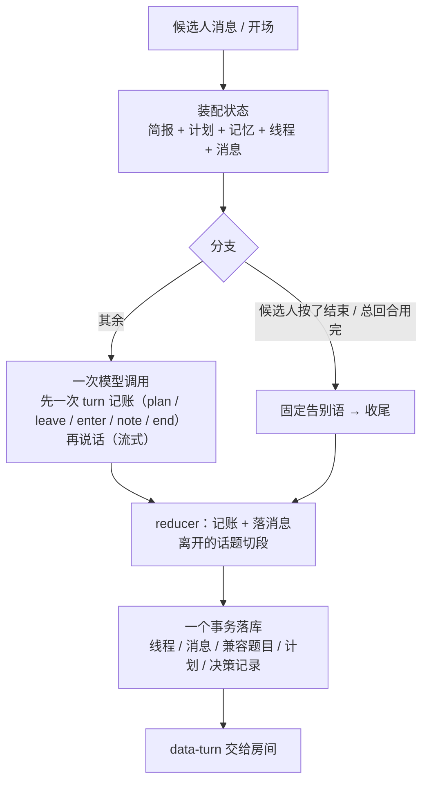

# 面试中：一个回合是怎么跑完的（v13，面试官拿计划、代码守底线、提示词分静态与现场、答疑不算回合）

> 上一篇：[面试开始前](interview-flow-before.md) · 下一篇：[面试结束后](interview-flow-after.md)
> 代码入口：`src/app/api/interviews/mock/[id]/turn/route.ts` → `interviewer/session.ts`（装配与落库）→ `interviewer/turn.ts`（回合核心）→ `interviewer/turn-agent.ts`（一次模型调用）→ `interviewer/reducer.ts`（记账）。体验版走 `src/app/api/trial/turn/route.ts`，同一个核心。
> 为什么这么设计：[interviewer-agency-plan.md](interviewer-agency-plan.md)。

## 0. 总览

面试的主动权在面试官（模型）：问什么、追不追、什么时候换话题、聊几个项目、几道基础题，都写在它自己的**计划**里；代码只做三件事——守一场的**总回合数**、按面试官的记账**切段落库**、执行候选人的**结束**按钮。

## 1. 定义

### 1.1 状态（`InterviewerState`，每回合从数据库重建，纯内存对象）

| 字段 | 内容 |
|---|---|
| brief | 材料（见开始前篇）：项目的五个面、基础题池、场景题、简历假设、总回合数 |
| plan | 面试官自己写的计划 `{ items[{ id, label, kind, areaId, turns }], note, revisedAtTurn }`；开场后第一回合写，之后可改 |
| memory | 工作记忆：已确认 / 存疑 / 失守 / 假设状态（`memory.ts`）。模型每回合只写增量；入库时按相似度合并（3 元字符组 Dice ≥ 0.45 或短句被长句覆盖 ≥ 0.85 算同一条，留更长的那句），写进已确认 / 失守的条目把存疑里相似的去掉；每列表最多 20 条，旧会话读出来时过同样的合并 |
| threads | 话题线程：`{ planItemId, areaId, kind, label, entryQuestion, status: active \| closed, depth, verdict, note, openedAtTurn, closedAtTurn }`。一个话题一条；进入时这句话是 `entryQuestion`，之后每问一句 `depth + 1` |
| messages | 面试官：intro_request / question（进入话题的那句）/ probe（话题内的后续）/ aside（答疑：复述、换个说法、给方向，不算回合）/ closing；候选人：answer（他说的一切，含求助、要求澄清）/ aside（只有代码执行的"结束"） |
| turnIndex / phase | 下一回合序号；opening / running / ended |

### 1.2 预算（唯一的硬数字）

节奏 → 一场的总回合数 `brief.turns`（面试官说话的次数，含开场与收尾，不含答疑）：quick 12、standard 20、deep 32。`turnsLeft = turns − 已说回合`。到 0 时下一回合由代码用固定告别语收尾。**答疑不算回合**：模型在 `turn.aside` 标出"这句只是答疑、复述、换个说法或给方向，题还是原来那道"，代码记成面试官侧的 aside 消息，不计数、不加话题深度；软顶是总回合的四分之一（标准节奏 5 句），超过后按普通回合数——这是"一场总会结束"这条底线的一部分，正常用碰不到。没有阶段预算、没有追问上限、没有连败阈值。

算术由代码做给模型看（`renderProgress`）：计划里没聊完的项合计约几回合（正在聊的按"计划 − 已问"）、只剩几回合、超了几回合；还剩 ≤3 回合且场景题没问时提醒"这回合就 enter [s1] 把它问出来（一问一收两回合），不要再追问、不要再开基础题"并附开题原句，最后一回合提醒"只告别，不提问、不 enter"——这句放在现场状态的最后一行（紧贴候选人的话），计划清单上同时标"← 这回合进 / ← 来不及了，不再问"：模型是顺着清单往下走的，只在进度行里提醒它不理。

### 1.3 代码守的底线（`reducer.planTurn`）

| 情形 | 处理 |
|---|---|
| 候选人点"结束"（按钮，或 40 字以内含"结束 / 别问了 / 不想答了 / 算了吧"等的插话） | 不调模型：进行中的话题切段（verdict 空），固定告别语，`endedBy=candidate` |
| 总回合用完 | 同上，`endedBy=budget` |
| 模型这回合没说出话（超时、5xx） | 接一句固定的话（"稍等，我整理一下……"），不改计划、不换话题，`failed=true` 进决策记录 |
| 额度 / 密钥 / 网络这类不可恢复错误 | 直接抛出，回合不落库，房间显示原因 |
| 同一时刻只有一个进行中的话题 | 模型没 `leave` 就 `enter`：代码替它离开，note 记"（面试官没有交代就换了话题）"，不算面试官的判断 |
| 记账自相矛盾 | 只 `leave` 不 `enter` 也不 `end`：话题继续。同一回合既 `enter` 新话题又 `end`：按进入算（这句话是一道题，候选人得答），预算到头由代码下一回合收。标了 `aside` 却 `enter` 了：按进入算 |

求助（"能给个提示吗"）、跳过、再说一遍、要求具体一点、答非所问，都是候选人对面试官说的话，模型自己应对；房间里的按钮只是把这些话替候选人打出来。

## 2. 接口层（`/turn`）

请求：`{ kind: "start" }` 或 `{ clientId, content, intent, voiceMetricsJson }`。`intent` 是按钮：hint / skip / repeat 只换成对应的话（"这题我不太会，能给个方向吗？"等），end 由代码执行。`clientId` 幂等：重复提交回放当时的面试官消息，不调模型。

响应：AI SDK 的 UI 消息流——面试官的话逐字流回，流结束前把回合结果以 `data-turn` 数据块交给前端（`turnPayload`：新消息、线程、计划、记忆、阶段进度、副作用、决策记录）。

## 3. 一次模型调用（`turn-agent.ts` + `prompt.ts`，`interviewer-v13`）

提示词分两半，为了 provider 的提示词缓存能命中（缓存按前缀匹配，前缀里任何一个字变了后面全部失效）：

- **系统提示词整场不变**（`buildInterviewerSystem`）：人设与档位 → 流程段（含排计划的三个事实：开场那回合也在总数里、场景题至少留两回合、基础题一场通常三四道）→ 怎么问（开题给抓手、追问落一点、一句一个要点，带正反例）→ 怎么面 → 记账说明 → **材料**（每个项目的五个面各带建议问法与线索、简历上要验证的说法；题池带"简历碰过"标记与一层追问方向；场景题带引导阶梯与 JD 原句）→ 技能包索引 → JD → 简历。
- **现场状态每回合变**（`renderTurnState`），跟候选人这句话一起放在**最后一条用户消息**里：进度（已说几回合、还剩几回合、答疑几句、计划合计还要几回合、超了几回合、尾段提醒）→ 计划（各项 ✓ / ▶ / ○，没写时要求先写）→ 当前话题（进入时问的、又问了几轮、计划几回合已问几轮、这道材料的期望信号、这个项目没验证的简历说法）→ 已结束的话题（一行一个）→ 聊过的材料 id → 工作记忆 → "候选人说："+ 候选人的话。系统提示词里写明：用户消息里"候选人说："之前是系统写的可信状态，之后才是候选人的不可信原话。
- **对话历史只追加**（`conversation.ts`）：整场保留双方说的话（不带状态块），不按话题裁剪；超过 12k 字符才从最旧的整条丢（最后两条不丢）。这样系统提示词 + 全部历史是稳定前缀，每回合新增的只有最后一条用户消息；同一回合的第二步（说话）与第一步（记账）只差一次工具调用。

记账只有一个工具 `turn`（`actions.ts`），一回合调一次，各字段可空：

| 字段 | 内容 | 代码怎么用 |
|---|---|---|
| plan | items[{ id, label, kind, areaId, turns }], note | 整份替换计划（同 id 去重；areaId 只认材料里有的） |
| leave | verdict（answered / thin / failed / skipped）, note | 离开当前话题：切段、写 verdict 与判断；先于 enter 应用 |
| enter | itemId, label, kind, areaId | 新话题：这回合的话是它的第一问；上一个话题没 leave 就替它离开；指向当前话题的 enter 视为继续；开场回合不接受 |
| note | 记忆增量 | 应用到工作记忆（只认简报里有的假设） |
| end | reason | 收尾：这回合的话是告别；与 enter 同时出现时按 enter 算 |
| aside | boolean | 这句只是答疑、复述、换个说法或给方向：不算回合、不加深度；超过软顶后按普通回合数 |

另有 `load_skill`（查技能包全文）。拆成五个工具时模型会一个一个调、每步重发整段提示词，一回合 1–4 步；合成一个后最多 3 步。

一次 `streamAgent`：`toolChoice: auto`，文本流式返回；流结束后从 `turn` 调用里读出记账（多次调用按先后合并），从最后一步的文本里读出这回合的话（`pickSpeech`：整段是 JSON 的不算，原句重复两遍的折半）。每次调用记 `AgentRun.cachedTokens`（provider 报的缓存命中），trace 页按回合显示"tokens（缓存 n）"。

## 4. 应用（`reducer.applyTurn`，纯函数）

1. 候选人消息落进当前话题（"结束"记为 aside）。
2. 代码定的收尾（结束按钮 / 预算用完）→ 固定告别语，返回。
3. 模型没说出话 → 接一句，返回。
4. 记忆增量、计划。
5. 先 leave 再 enter：leave 切段（verdict + 判断）；enter 先替没交代的上一话题离开，再开新线程（`entryQuestion` = 这句话）。开场回合不接受 enter（自我介绍不成段）；指向当前话题的 enter 视为继续。
6. `end` → 进行中的话题切段（verdict 空），这句话记为 closing，`phase=ended`；否则这句话记为 question（刚进入话题）/ aside（答疑，不加深度）/ probe（话题内）/ intro_request（开场），话题 `depth + 1`。

副作用：`thread_closed`（带切出的段：第一问 + 之后各问、候选人在这个话题里说的全部话）、`interview_ended`。决策记录：`planChanged / entered / left / endedBy / failed`。

## 5. 切段与落库（`segments.ts` + `session.persistTurn`，一个事务）

- 话题离开时写一条兼容层 `InterviewQuestion`：题目 = 第一问 + "追问 n：…"，回答 = 候选人在话题内的话拼接；对应简报材料的用材料的评分表与期望信号，计划外的话题按种类用固定评分表（`rubricForArea(kind)`）；`skipped` = verdict 为 skipped 或没有回答。`generationMetadataJson` 记 areaId / areaName（话题标签）/ areaKind / competencyOrigin / skillPack / note / depth / probeCount / verdict / answerSeconds。
- 同一回合序号只能落一次（并发的第二个回合失败而不是写乱）。线程、消息、计划（`planJson`）、记忆、决策记录（`InterviewTurnDecision`：planChanged / entered / leftVerdict / endedBy / failed / memoryPatchJson / turnsUsed / skillsLoaded / effectsJson）一起写；收尾时 `status=ready_to_evaluate` 并安排自动交卷。
- 有回答的段落异步评分（`question-evaluation-background.ts`）。

## 6. 前端房间、报告与 trace

- 房间顶栏：面试官的计划（聊过的划掉、正在聊的高亮、还没聊的灰色）和回合进度 `已说/总数`；候选人第一次看得见面试官打算聊什么。按钮：要个提示 / 再说一遍 / 跳过这题 / 结束面试。
- 报告"这场问了什么"：按话题种类分节，列每个聊过的话题（标签、追问轮数、verdict、面试官的判断、得分）。总分按种类加权：项目 3、场景 2、基础 1。
- trace 页：每回合标记"改了计划 / 进入：X / 离开：verdict / 收尾：谁定的 / 模型没说出话"，面试官的答疑标"答疑（不算回合）"，加记忆增量与模型开销。

## 7. 输入防御

JD、简历、候选人的话都是不可信数据（`run-agent` 的防注入基座）；岗位名拼进指令位前清洗并标注不可信；候选人回答里的"结束面试"这类指令只在 40 字以内的插话里才被代码认作意图，长回答一律交给模型当作回答处理；技能包是可信资料。

## 8. 体验版（网页版）怎么走这一段

状态随请求带上（简报、记忆、计划、线程、消息），跑同一个 `runInterviewerTurn`，`data-turn` 回来后 `applyTurnPayload` 写进浏览器的会话文档（v7，`plan` 字段随之带上）；切段与评分在浏览器里按同一批纯函数进行。
