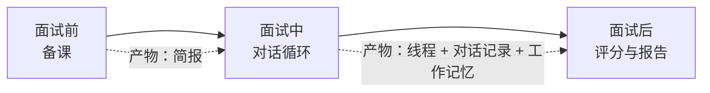

# AI 模拟面试：整体流程（人人可读版）

> 配套细节文档：[面试开始前](interview-flow-before.md) · [面试中](interview-flow-during.md) · [面试后](interview-flow-after.md) · [评测](eval.md)。
> 代码版本：interviewer-v4 / 简报 v4 / brief-v7 / 画像 ability-assessment-v5（2026-09-10）。

## 一句话

用户选一份简历、贴一段岗位描述、选一个节奏，系统扮演一位**会备课、会追问、会自己决定何时结束**的面试官，像真人一样对话；结束后按事先定好的标准逐段评分，出一份带证据的报告。

## 三个阶段

### 1. 面试前：备课（约 20 到 40 秒，后台进行）

真人面试官面试前会翻简历、圈出要深挖的点、心里列一张"这个岗位必须考察什么"的清单。系统做的是同一件事，产物叫**简报**：

- **考察领域**：几个要考的方向（比如"Study Assistant 项目深挖""Agent 评测体系"），每个领域带一道切入问题、一条追问阶梯（每级标了是问事实、原理、场景还是取舍）、一份好回答该有的信号，以及打算追问几层。技术领域分两种风格：从场景切入，或直接考基础原理。
- **领域从哪来**：JD 明确要求的方向必须覆盖；JD 没写到但这个岗位通常会考的，由面试官从**技能包**（仓库内按岗位整理的面试资料，面试官自己决定加载哪几本）里补，报告里会标明来源。
- **简历假设**：简历上值得验证的点（写了"降低 60%"的成果、只写框架名的经历），每条都逐字引用简历原文。
- **评分表**：按领域类型与风格（场景题 / 基础题 / 项目 / 行为）各用一套固定的评分维度，开场前冻结，面试中不改。

领域数量和每个领域挖多深，由备课模型在用户选的节奏预算内自行分配：少而深、多而浅都行。

### 2. 面试中：对话循环

用户进入一个全屏的面试间，面试官先请自我介绍，然后按简报开始一个领域的线程：问切入问题 → 顺着回答追问 → 卡住时给一次提示 → 问够了收住这段，紧接着开下一段或收尾。

每一回合模型都是"提案"：它说一段话（先回应刚才的回答：追认、纠偏或对质，再提问），同时声明想做的动作（开线程、追问、提示、澄清题目、打断跑题、关线程、收尾）。代码负责"裁决"：动作是否越过不变量（追问层数、每领域线程数、每线程的提示 / 澄清 / 打断次数、安全上限），追问是否锚在候选人的原话上。越界的动作被换成代码的确定性下一步，所以面试永远不会卡死，也永远不会停在一个问句上。面试官需要判断回答准不准时，可以自己查技能包。

面试官有一份**工作记忆**：已确认的、存疑的、失守的要点，以及每条简历假设的验证状态。每回合的上下文里，对话原文只带进行中的线程和上一段的最后一问一答；更早的线程只剩结束时的一句判断，其余靠工作记忆。

结束条件：面试的长短由**信息量**决定。用户选的节奏映射成信息量目标（快速 60%、标准 75%、深入 90%），代码按"各领域追到了目标深度的几成、简历假设验证了几条"实时算；达标后面试官觉得够了就收尾。澄清、提示这类不产生信息的回合不影响长短。回合数只留一个远高于正常值的安全上限。候选人随时可以点"结束面试"。

### 3. 面试后：评分与报告

每个线程关闭时立刻被切成"一段"：切入问题 + 追问 = 题目，候选人在该线程内的全部回答 = 答案，连同该领域的评分表、期望信号、追到第几层和面试官关掉这段时的判断，一起送去后台逐段评分。评分给的是：各维度的分数、支持分数的原话与缺口，答得好的（带原话引用），短板（说错的 / 追问到没答上的，带原话），以及练什么。有短板的段落再由一个示范 agent 用候选人自己的项目写一段"这样答"，示范里核实不了的数字会被抹掉。

面试官收尾后报告自动生成：总分按领域权重加权；汇总 agent 读面试全貌（每个领域追到第几层、面试官的判断、工作记忆、简历假设）写总体评价，把站得住的与失守的挂到具体领域，并给每条简历假设一句结论。报告落库后更新长期的能力画像。

## 谁在做决定

| 事项 | 模型 | 代码 |
|---|---|---|
| 考察哪些领域、各挖多深、问什么 | 提案 | 按节奏预算裁剪，评分表按类型固定 |
| 简历假设 | 提案 | 证据必须逐字出现在简历里，否则整条丢弃 |
| 每回合说什么、做什么动作 | 提案 | 预算不允许就换成确定性下一步 |
| 什么时候收尾 | 信息量达标后自行判断 | 达标前不许（领域问完或候选人连续失守除外），安全上限强制 |
| 候选人说"跳过 / 再说一遍 / 结束" | 不参与 | 代码识别并直接执行 |
| 候选人说"要提示 / 没听懂" | 判断该澄清题目还是给台阶 | 只识别成信号交给模型 |
| 每回合做了什么决定 | 提案 | 落一条决策记录（提案、裁决、替换原因、信息量变化），报告页可看 |
| 逐段评分 | 按评分表打分、给证据与缺口、列优点短板 | 维度名必须与评分表一致，加权算分；引用不在回答里的置空并计数 |
| 示范回答 | 用候选人的项目写示范 | 示范里的数字必须能在简历或回答里找到，否则抹掉 |
| 报告汇总 | 总体评价、优点短板挂领域、假设结论 | 总分按领域权重加权；领域名必须存在；面试官标过的假设状态不改 |

## 用户看到什么

| 阶段 | 页面 |
|---|---|
| 创建 | 表单：公司、岗位、简历、岗位描述（必填）、轮次、节奏（快速 / 标准 / 深入）、作答方式 |
| 备课 | 进度卡片："正在分析岗位""面试官正在备课" |
| 面试 | 全屏房间：对话气泡、输入框、"要个提示 / 再说一遍 / 跳过这题 / 结束面试"，顶栏一个已用时的钟。看不到考察领域和面试官的计划 |
| 结束 | 面试官收尾后报告自动生成，房间等一会儿就跳到报告页：总分、总体评价、考察领域（追到第几层、面试官的判断）、简历上的说法经不经得起问、站得住的 / 失守在哪 / 下一步练什么、逐段反馈（带原话引用、缺口、用你的项目示范怎么答）、面试官的工作记忆、对话记录 |

## 术语表

| 术语 | 含义 |
|---|---|
| 节奏（pace） | 用户选的面试长短：映射成信息量目标（快速 0.6、标准 0.75、深入 0.9）与备课的规划规模 |
| 回合（turn） | 候选人一条消息加面试官一次回应。只有切入问题、追问、打断算"提问回合"，澄清和提示不算 |
| 信息量（evidence） | 这场面试摸清了多少：领域覆盖（按权重）八成加简历假设验证进度两成 |
| 决策记录 | 每回合一条：模型提了什么、代码用了什么、为什么换、信息量怎么变；trace 页面可看 |
| 简报（brief） | 备课产物：领域 + 假设 + 评分表，开场前冻结 |
| 技能包（skill） | 按岗位方向整理的面试资料（主题、阶梯、好题、危险信号）；面试官按索引自行加载 |
| 岗位基线（baseline） | JD 没写到、但这个岗位通常会考的方向，来自技能包 |
| 风格（style） | 技术领域的问法：scenario 从场景切入，fundamentals 直接考原理；阶梯每级也标风格 |
| 领域（area） | 一个考察方向，带切入问题、阶梯、期望信号、目标深度 |
| 线程（thread） | 在一个领域内的一段连续问答，从切入问题到收住 |
| 深度（depth） | 线程内追问的层数；简报里的 depth 是目标，允许多追一层 |
| 工作记忆（memory） | 面试官的笔记：已确认 / 存疑 / 失守 / 假设状态 |
| 评分表（rubric） | 按领域类型固定的评分维度与权重 |
| 期望信号（expected signals） | 好回答会出现的要点，只给评分用，不给候选人看 |
| 兼容题目 | 线程关闭后切出的"一道题"，复用原有的逐题评分、复盘、画像链路 |
