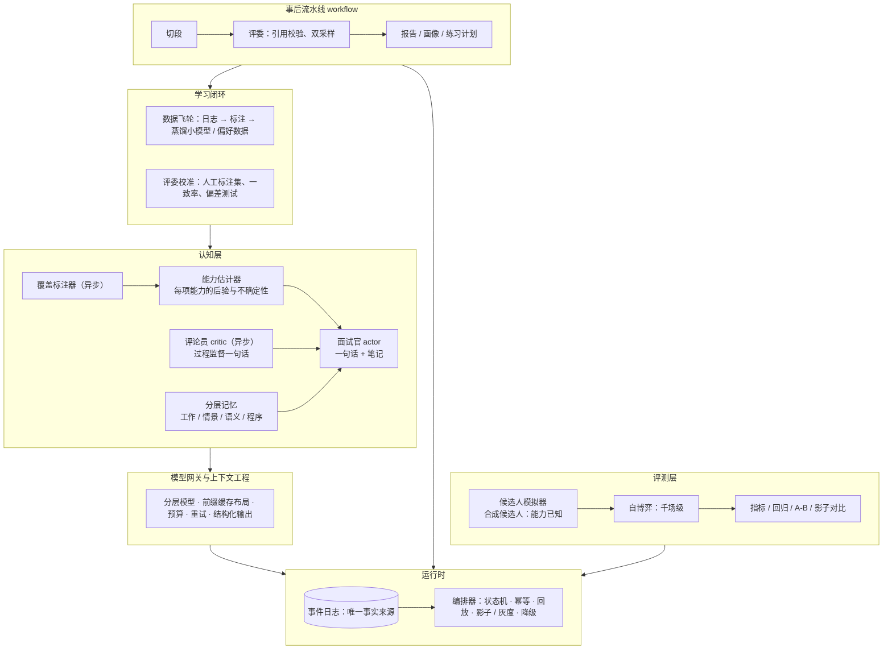

# AI 模拟面试系统设计（从零出发，v2，2026-09-14，待讨论）

> 不参考当前代码结构。回答的问题是：从零设计一个能拿去当大厂 agent 岗位简历项目的 AI 模拟面试系统，它应该长什么样、为什么、深在哪。v1 把"agent 在中间、workflow 在两头"的形式定了；v2 补的是深度——把它从"一个会问问题的聊天机器人"变成"一个有决策核心、有学习闭环、有生产级运行时、能用自博弈评测的 agent 系统"。落地时再映射到现有代码。

## 0. 一句话

**面试是一段被时间盒约束的自由对话，前后各接一条确定性流水线；对话里的"下一步问什么"是一个在不确定性下做决策的问题。** 面试官 agent 只负责像人那样说话；它的目标由一个能力估计器给出（哪项能力最不确定、最值得花时间）；它的过程由一个异步评论员盯着；结构化产物（切段、评分、画像）由事后流水线产出；一切通过事件日志沟通；策略的好坏由成千上万场与合成候选人的自博弈来度量，而不是跑一场看印象。

## 1. 目标与非目标

目标：
- 候选人上传简历、给一个 JD，得到一场像真的技术面试；结束后得到有原话依据的逐题反馈、能力画像与练习建议。
- 面试官的追问是**有目的的**：每个问题都在缩小对某项能力的不确定性，而不是走题库。
- 每一次改动都能用可重复的评测（自博弈 + 校准过的评委）说明更好还是更差。
- 成本、延迟、故障有预算与降级；组件可单独替换；新提示词能影子运行再灰度。

非目标（本期）：真人面试官接入、代码沙盒、多面试官 panel。语音只做接口预留。

## 2. 真实面试是怎么进行的

技术一面（40–60 分钟）：

| 阶段 | 面试官在做什么 | 脑子里的状态 |
|---|---|---|
| 进门前 | 读简历与 JD，圈出要验证的说法，列三四个必摸清的能力 | 一张清单、几条假设、一个时间盒 |
| 项目深挖（60%） | 顺着候选人的话追：为什么、数字怎么来的、最难的地方、重做会改什么；实就深追，虚就换角度或换项目 | 每项能力"摸清了 / 还虚"；时间还剩多少 |
| 基础与原理（20%） | 从项目里用到的东西问原理；不会就下一个 | 哪些基础顺带验过了 |
| 场景题（15%） | 岗位相关的开放场景，看拆解与取舍 | 卡住了往哪引 |
| 收尾（5%） | 候选人提问、告别 | — |
| 事后 | 按维度填 scorecard，写证据与结论 | — |

三个观察：

1. **面试中没有结构化记账。** 只有清单和时钟；结构化在两头。
2. **面试官在做序贯决策。** 每个追问都是在"这项能力我已经有多确定"与"剩多少时间"之间做取舍：确定了就换，还虚且重要就追，不重要就一句话带过。好面试官问得少而准，因为他在最大化每分钟获得的信息。
3. **核心能力是找证据。** 这是不是他做的、懂不懂为什么、数字是不是真的。

## 3. 用户想要什么 → 系统要求

| 用户想要 | 系统要求 |
|---|---|
| 问题从我的简历和 JD 里长出来 | 备课产出"证据缺口清单"，不是题库 |
| 追问到我答不上的地方 | 策略以缩小不确定性为目标，答得实就深追 |
| 不浪费时间：不重复、八股不泛滥、按时结束 | 时间盒；跨场记忆；每个问题有信息价值 |
| 结束后知道哪里不行、怎么改 | 评分引用原话（代码校验）、强答案示范、练习计划 |
| 能控制：澄清、求助、跳过、结束、重来一题 | 候选人的话就是话，不扣时间；会话可分叉 |
| 相信反馈是准的 | 评委与人工标注对齐；结论必须有引用；不一致就降置信 |
| 看到进步 | 跨场能力画像，按证据与置信度累积 |

用户看不见也不关心：面试官"进入 / 离开"了哪个话题、计划改了几次。**任何为了系统内部方便而要求模型在对话中维护的结构，都是给体验挖坑。**

## 4. 形式：agent 在中间，workflow 在两头

定义：workflow 是固定步骤图，LLM 只在节点里做转换；agent 是循环，模型每步自己决定下一步。

三种纯形式都不对：**纯 workflow**（阶段 × 预算 × 门）让模型在格子里做局部最优，每个新情况加一条规则，规则互相打架——已证伪。**纯 agent**（一个模型从备课到评分全包）让确定性任务不可复现、不可校准、不可缓存。**对话 agent + 结构化记账**（模型一边说话一边填 plan / enter / leave / verdict）把事后的 scorecard 提前到对话里，模型顾此失彼，记错一次全链路跟着错——这是现状。

分界原则：
1. 能让模型自由做的，绝不写成状态机——问什么、追不追、怎么应对"具体点"。
2. 必须保证的，用最少代码保证——时间盒、结束按钮、模型没说话时接一句、每步落库。
3. 结构化产物放在对话之外做——切段、评分、画像由事后流水线产出，可重跑。
4. 一切可观察、可回放、可重放——会话是事件日志。
5. **决策要有依据**——"下一步问什么"不能只靠提示词里的形容词，要有一个量在指路。

## 5. 分层架构



## 6. 深度在哪：六个核心设计

每一条都写四件事：是什么、为什么这是 agent 工程而不是提示词工程、怎么做、怎么量。

### 6.1 自适应追问：能力估计器 + 信息增益（决策核心）

**是什么。** 把面试当成自适应测验（CAT）：岗位有 6–8 项能力 $c$，每项有一个潜在能力值 $\theta_c$；每次问答是一次"测量"，题的难度来自材料的阶梯层级（第一层易、第四层难），测量结果来自在线评委的打分。估计器维护每项能力的后验（均值与不确定性），并算出**每项能力再问一次的期望信息增益 × 岗位权重 ÷ 时间成本**。面试官每回合看到的不是"计划清单"，而是一行：`最值得追：系统可靠性（估计 中，置信 低，岗位权重 高）；已足够确定：RAG 基础（估计 高，置信 高）`。它自己决定怎么问。

**为什么是 agent 工程。** 这把"下一步问什么"从提示词里的形容词（"答得完整就换话题"）变成一个可计算、可评测的决策量；面试官依然自由措辞，但目标是算出来的。停止规则也自然出来：所有高权重能力的后验足够确定，或时间用完。

**怎么做。** 
- 备课时给每份材料标能力与难度层（材料本来就有阶梯）。
- 在线评委（小模型，每段问答结束时跑，见 6.4）给出这段的分数与置信；估计器做贝叶斯更新。最简版本：每项能力按难度分桶的 Beta 后验；进阶版本：两参数 IRT（难度、区分度）用历史数据拟合。
- 输出写进现场卡，一行；面试官提示词只说"优先追最值得追的，措辞与角度你定"。
- 模拟器（6.3）的合成候选人**能力已知**，所以能直接量估计器准不准。

**怎么量。** 达到目标置信所需的问答数（越少越好）、估计值与真值的相关、与固定流程面试官相比在同样时长下的信息量。

### 6.2 actor–critic：异步评论员做过程监督

**是什么。** 一个小模型每回合看最近几次交换，按"面试官该怎么做"的准则（追问是否贴着上一句、是否一句一个要点、候选人要求具体时是否收窄、跑题有没有指出、同一点是否追了太多轮）给出**至多一句**提醒，注入下一回合的现场卡。异步、不阻塞、跑慢了就没有。

**为什么。** 单次调用既要说话又要自省，负载过重（已在实践里看到）。把"自省"拆出去交给便宜模型，是过程奖励（process reward）的最小实现：它监督的是行为准则，不是结果。评论员的输出还是天然的偏好数据（哪些回合被提醒、提醒了什么），喂给 6.5 的飞轮。

**怎么量。** 自博弈里开 / 关评论员对比：违反准则的回合比例、候选人求助后被正确处理的比例、评委给的整体质量分。

### 6.3 多智能体自博弈：合成候选人与千场级评测

**是什么。** 候选人模拟器是一个 agent：有画像（扎实 / 一知半解 / 爱跑题 / 爱求助 / 对抗），更重要的是**每项能力的真实水平是采样出来的、已知的**——模拟器按"这项能力 θ=0.3"来答：术语对、机制错。面试官对它面试；评委给分；估计器给估计。一个策略变体跑几百到上千场，看分布。

**为什么。** 这是大模型对话系统评测的标准做法：真人样本贵、慢、不可重复；合成候选人可重复、可控、能力真值已知。它同时评三样东西：面试官策略（信息效率、准则遵守）、估计器（准确度）、评委（与真值的一致）。

**怎么做。** 模拟器用小模型 + 画像提示词 + "只回答刚才的问题"；用例 = 岗位 × 简历 × 画像 × 种子；跑在编排器的同一条路径上（模拟器只是另一个客户端）；结果进指标表。对抗画像专门测注入与泄露。

**怎么量。** 每个策略变体一张表：覆盖（几个项目、几面、场景题问没问、时间盒）、信息效率（达到置信的问答数）、准则遵守（评论员 / 评委）、应对（求助、跑题、答不上）、成本（token、缓存率、p95）。变体间做配对比较与显著性检验。

### 6.4 评委：两级、有引用、经校准

**是什么。** 在线评委（小模型，每段结束即跑，供估计器与评论员用）与离线评委（强模型，面试后跑，供报告用），共用同一套评分表与输出契约。每条结论必须引用逐字稿区间，代码校验逐字存在，不存在则丢弃并降置信；同段双采样，分歧大标低置信。

**校准。** 维护几十到上百段的人工标注集；每次改评委提示词，跑一致率（Spearman / kappa）与偏差测试（位置偏差、篇幅偏差、术语堆砌偏差——一段只有关键词没有机制的回答不能得高分）。一致率下降的改动不合并。在线评委与离线评委的一致率也要跟踪，差太多说明小模型不够。

**为什么。** 评委是整个系统的奖励函数：估计器靠它更新、自博弈靠它打分、飞轮靠它标注。奖励函数不校准，上面全是空中楼阁。

### 6.5 学习闭环：数据飞轮与蒸馏

**是什么。** 事件日志里天然积累：每次交换的标签（覆盖标注器）、每段的评分与引用（评委）、每回合的评论员提醒、用户的显式反馈（这题问得好 / 评分不准）。用它们做三件事：
1. **蒸馏**：把标注器与在线评委从通用小模型换成用自己日志微调的更小模型（SFT），量成本与延迟下降、一致率不降。
2. **偏好数据**：评论员无提醒的回合 vs 有提醒的回合、用户点赞 vs 点踩的问题，构成面试官的偏好对；先用于离线评测（哪个提示词版本更符合偏好），有条件再做 DPO 微调一个小面试官模型。
3. **题目与材料的质量回流**：哪些材料从来问不出区分度（所有候选人都答对或都答错）→ 备课降权。

**为什么。** 大厂 agent 团队最关心的不是第一版效果，是系统能不能靠自己的数据变好、变便宜。这一节不必全部实现，但数据结构与流程从第一天就要为它设计（日志字段、标签 schema、反馈入口）。

**怎么量。** 蒸馏前后：成本 / 延迟 / 一致率。偏好评测：新旧提示词的偏好胜率。

### 6.6 生产级运行时：事件溯源、可重放、影子与灰度

**是什么。**
- **事件日志是唯一事实来源**：`candidate_said / interviewer_said / notebook_written / tool_called / clock_tick / control / label_added / estimate_updated / critic_noted / segment_scored / fallback_used / model_error`。逐字稿、报告、trace、进度条全是投影；能回到任意一句分叉（"从这题重来"）。
- **可重放**：每次模型调用的输入与输出都记录；重放一场时不调模型，用记录的输出——这让编排器、估计器、切段的改动能在旧日志上回归，秒级、零成本。
- **幂等与并发**：客户端 id 去重；同一场同一时刻只有一个进行中的回合；写事件是一个事务。
- **影子运行**：新版提示词 / 策略在真实对话上并行跑（不展示给用户），输出交给评委与旧版比较；灰度按百分比放量；预算超限自动切便宜模型；熔断后走固定话。
- **可观察**：每次调用一个 span（输入 / 缓存 / 输出 token、延迟、降级、模型版本、提示词版本），每场一张仪表。

**为什么。** 没有这些，任何"更好了"都只是感觉；有了这些，每个改动都有对照、可回滚、可解释。这是把 agent 当服务而不是脚本来做的分水岭。

## 7. 一回合的时序

```
候选人说一句
  → 编排器：幂等检查、写 candidate_said、更新时钟估计
  → 组装现场卡：已用/总时长 · 上一回合笔记 · 估计器的一行 · 评论员的一行（若有）· 标注器的"聊过什么"（若有）
  → 面试官 actor 一次调用（可查技能包 / 简历原文）→ { say, notebook }
  → 校验 say（长度、不泄露）→ 写 interviewer_said、notebook_written → 流式返回
  → 异步：标注器打标签 → 若一段结束：在线评委打分 → 估计器更新 → 评论员看最近交换
时钟到 90%：现场卡提醒收尾；到 100%：编排器收尾。候选人点结束：立即收尾。
```

面试官的上下文布局（为缓存与稳定）：系统提示词 = 人设与方法（≤ 400 token）+ 材料包 + 技能索引 + JD 与简历（标注不可信），整场不变；历史只追加；现场卡在最后一条用户消息里，候选人的话在其后、标注不可信。

## 8. 记忆：四层，各有归属

| 层 | 内容 | 谁维护 | 怎么用 |
|---|---|---|---|
| 工作记忆 | 笔记（≤ 300 字，自由文本，整份重写） | 面试官自己 | 原样放回下一回合 |
| 情景记忆 | 本场事件日志 | 运行时 | 面试官可检索"他前面说的那个数字"（工具，只读） |
| 语义记忆 | 候选人的说法 ↔ 证据 ↔ 能力（跨场知识图） | 评委与画像流水线 | 备课时带上上次弱项与问过的题；面试中可查"这条说法上次验过没" |
| 程序记忆 | 技能包、评分表、能力模型 | 人工维护 | 渐进披露，需要时才读正文 |

## 9. 非功能

- **成本**：模型分层（actor 中等、标注 / 在线评委 / 评论员 / 模拟器小、离线评委强）；前缀缓存命中目标 ≥ 80%；每场预算与告警。
- **延迟**：actor 首 token p95 < 3 秒、整句 p95 < 8 秒；异步组件不进关键路径；报告 60 秒内。
- **安全**：指令层级（系统提示词是唯一指令源，JD / 简历 / 候选人的话 / 技能包正文都是数据）；对抗画像常驻评测集；不泄露评分表与假设；个人数据按会话隔离、可导出与删除。
- **降级**：模型超时 → 固定话；标注器 / 评论员失败 → 跳过；评委失败 → 排队；额度问题 → 明确报错、可恢复。

## 10. 扩展方向（留位）

- **语音**：时钟换真实时间；actor 输出接 TTS 并支持先说前半句；候选人输入接 ASR；打断（barge-in）作为 `control` 事件。其余不变。
- **导演 + 演员**：若自博弈显示单次调用的策略质量不够，把"决定下一步"拆成单独一次调用；估计器的一行仍是导演的输入。
- **其他轮次与 panel**：不同材料包与人设；多面试官共享事件日志。
- **代码题**：沙盒执行作为工具接入（已搁置）。

## 11. 分阶段落地

1. **运行时与评测地基**：事件日志 + 可重放 + 候选人模拟器（能力已知）+ 指标脚本；用现有系统跑基线。
2. **面试官重建**：笔记替代所有记账结构；时钟替代回合；`{ say, notebook }` 输出契约；编排器缩到四件事。
3. **评委两级 + 引用校验 + 人工标注集**：先离线评委接报告，再上在线评委。
4. **估计器 + 现场卡的一行**：先 Beta 后验版本；用模拟器量准确度与信息效率。
5. **评论员**：开 / 关对比。
6. **影子与灰度、仪表**。
7. **飞轮**：蒸馏标注器；偏好评测；材料区分度回流。
8. 语音预留、网页版同构。

1–4 是核心，做到 4 这个项目就已经和"聊天机器人"划清界限；5–7 是加分项，各自独立可讲。

## 12. 作为简历项目怎么讲

- **架构判断**：对话用 agent、两头用 workflow；决策核心是能力估计与信息增益，而不是提示词里的形容词；什么坚决不让模型在对话中维护。
- **agent 工程**：actor–critic 异步过程监督；四层记忆各有归属；只读工具与渐进披露；结构化输出契约与降级。
- **评测与学习**：能力已知的合成候选人自博弈；两级评委、引用校验、人工标注一致率与偏差测试；数据飞轮与蒸馏。
- **生产级运行时**：事件溯源、可重放回归、影子运行与灰度、预算与熔断、全链路 trace。
- **可量化的数字**（做完填）：达到目标置信的平均问答数、估计值与真值相关、评委一致率、缓存命中率、每场成本、p95 延迟、蒸馏后成本降幅、开 / 关评论员的准则违反率。
- **踩过的坑**：阶段 × 门的状态机、模型边说话边记账——两次失败与从中得出的分界原则，是面试里最好的素材。

## 13. 要用户定的

1. 形式与分层认不认；深度点 6.1–6.6 里哪些进本期（建议 1–4 阶段全做，5–7 挑一两个）。
2. 事件日志作为唯一事实来源会重做持久化层，接受吗。
3. 能力估计器先做最简的 Beta 后验版本，IRT 留作升级，接受吗。
4. 评测先行：先做模拟器与基线，再动面试官。

## 14. 其余技术怎么并进来（按功能必要性，不为覆盖而覆盖）

Agentic RL、训练与蒸馏、推理部署由另一个简历项目覆盖，这里不做。其余逐项判断"产品里有没有真实的需要"。

| 技术 | 判断 | 产品里的真实需要 | 做到什么程度 |
|---|---|---|---|
| 记忆机制 | **并入，核心** | 用户练很多场后要看进步、不重复问、验证上次的说法；估计器要跨场先验 | 语义记忆做成独立模块：说法 ↔ 证据 ↔ 能力的图，写入来自评委产出，带置信与时间衰减，冲突（上次说 X 这次说 Y）浮给面试官。用自博弈量：重复提问率、上次弱项被再验的比例、跨场先验让达到置信的问答数减少多少 |
| 检索（RAG） | **并入，但只在需要的地方** | 简历一两页、技能包目录小、一场对话装得进上下文——都不需要检索。真正会长大的是候选人的历史（几十场逐字稿与评分）与评委写"强答案示范"时要引用的技能包正文 | 作为记忆模块的检索层做：BM25 + 向量 + 重排，评 recall@k 与引用忠实度。不单独立一个 RAG 系统 |
| 工具协议与编排 | **并入内部层；MCP 视客户端需要** | 面试官、评委、备课都要查简历段落、技能包、历史；这些调用要有统一的 schema、只读 / 有副作用的分级、超时、追踪 | 一个内部工具注册表 + 网关（schema 校验、权限级别、超时重试、每次调用一个 span）。产品里没有不可逆动作，"执行审批"不做。若要让 IDE 或其他 agent 客户端发起练习、查报告，再把它暴露为 MCP server——那是产品功能，不是技术展示 |
| 评测平台化 | **并入，核心** | 自博弈、回归、A/B、影子对比全靠它 | 用例集、运行器、指标表、仪表，和 CI 挂钩；抽成项目内可复用的 harness，不做通用产品 |
| LLMOps | **并入** | 影子运行、灰度、成本预算、提示词版本对比都需要追踪与版本仓库 | 用 OpenTelemetry / Langfuse 落地追踪与提示词版本，不自己造 |
| 安全治理 | **按比例并入** | 简历 / JD / 候选人的话都是注入面；评分表不能泄露；个人数据要可删 | 指令层级、输出校验、对抗画像进回归集、数据隔离与删除。护栏模型与审批机制没有对应的产品风险，不做 |
| 多智能体框架 | **不做框架，做清楚的角色与协议** | 系统里确实有 actor / critic / judge / simulator / labeler 五个角色，靠事件日志当黑板协作 | 把角色、消息、协作方式写清楚并落地即可；不抽通用框架。面试里能讲清与 LangGraph / AutoGen / OpenAI Agents SDK 的取舍 |
| 语音实时 | **并入，核心之后** | 真实面试是说的；练表达、练临场是用户的真实需求，且时钟模型天然对齐 | ASR / TTS / VAD / 打断作为 `control` 事件；先说前半句的流式生成。放在 1–4 阶段之后 |
| 长程规划（DeepResearch 式） | **不并入** | 面试是短对话；备课不联网（产品决定）；练习计划几步就完 | 另做小项目 |
| 代码 / 质量场景 | **不并入本期** | 一面确实常有手撕代码，是合理的"代码题轮次"，但需要沙盒（此前决定搁置），工程量独立 | 作为未来轮次留位；为抖音质量 JD 另做小项目 |
